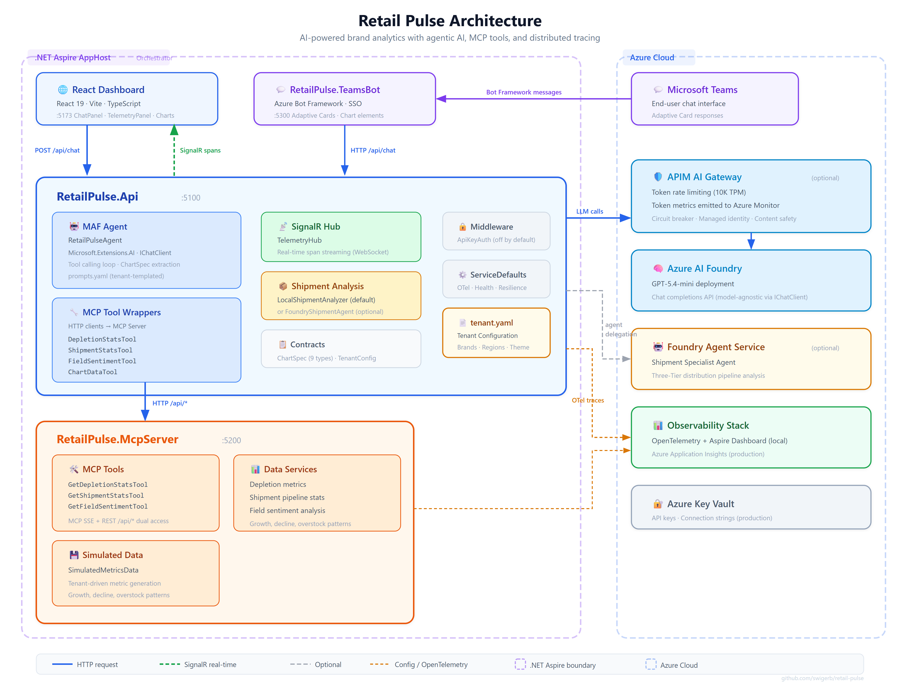

# 📊 Retail Pulse

> AI-powered brand analytics for retail & consumer goods

[](https://dotnet.microsoft.com/)
[](https://react.dev/)
[](https://learn.microsoft.com/dotnet/aspire/)
[](LICENSE)

## Overview

Retail Pulse is an AI-powered brand intelligence platform that uses agentic AI to analyze depletion trends, shipment dynamics, and field sentiment for retail & CPG brands. A **multi-agent system** powered by the Microsoft AI Framework (MAF) and Model Context Protocol (MCP) reasons over natural-language questions, delegates to specialist agents, and calls MCP tools to fetch data — streaming every step back to the browser with full distributed tracing.

**Key differentiator:** Retail Pulse is **tenant-configurable**. Define your company, brands, regions, and theme in a single `tenant.yaml` file and the entire platform adapts — no code changes required.

**Built with:** .NET Aspire, Microsoft AI Framework (MAF), Model Context Protocol (MCP), React + Vite, Azure Bot Framework, Azure API Management (AI Gateway).

---

## Architecture



### Components

| Component | Description |
|-----------|-------------|
| **Aspire AppHost** | Orchestrates all services with a single `dotnet run` |
| **API + MAF Agents** | AI agent with tool calling, multi-agent delegation |
| **MCP Server** | Standardized data tools (depletions, shipments, sentiment) |
| **React Dashboard** | Interactive chat UI with real-time telemetry |
| **Teams Bot** | Adaptive Card responses with chart visualizations |

### Three-Tier Distribution Model

Retail Pulse is designed for industries using a Three-Tier distribution model (manufacturer → distributor → retailer). The AI agent can detect **pipeline clogs** — where shipments and sell-through diverge — and correlate them with field sentiment data.

---

## Quick Start

### Prerequisites

- [.NET 10 SDK](https://dotnet.microsoft.com/download/dotnet/10.0)
- [Node.js 20+](https://nodejs.org/)
- An OpenAI API key (or Azure OpenAI endpoint)

### 1. Clone the repo

```bash
git clone https://github.com/swigerb/retail-pulse.git
cd retail-pulse
```

### 2. Configure tenant.yaml (or use the included Apex Retail Group sample)

The repo ships with a sample `tenant.yaml` for **Apex Retail Group**, a fictional multi-category retail conglomerate with 12 brands across 6 categories. To customize for your own brand, see the [Tenant Configuration Guide](docs/tenant-configuration.md).

### 3. Set up Azure OpenAI credentials

```bash
dotnet user-secrets set "OpenAI:ApiKey" "<your-api-key>" --project src/RetailPulse.Api
```

> To use Azure OpenAI directly (bypassing APIM), also set the endpoint:
> ```bash
> dotnet user-secrets set "OpenAI:Endpoint" "<your-azure-openai-endpoint>" --project src/RetailPulse.Api
> ```

### 4. Run with Aspire

```bash
# Install frontend dependencies (first time only)
cd src/RetailPulse.Web && npm install && cd ../..

# Start the full stack
dotnet run --project src/RetailPulse.AppHost
```

### 5. Open the React dashboard

Navigate to [http://localhost:5173](http://localhost:5173) and start asking questions!

**Try these queries (using the Apex Retail Group sample tenant):**

**🥃 Spirits:**
- *"How is Sierra Gold Tequila performing in the Northeast?"*
- *"Analyze the shipment pipeline for Ridgeline Bourbon in the Midwest"*

**🛒 Grocery:**
- *"How are FreshMart depletions trending in the Northeast this quarter?"*
- *"Compare Harvest Table vs FreshMart sell-through rates by region"*

**🍔 Quick-Serve Restaurants:**
- *"How is Apex Grill performing in the Southwest this quarter?"*
- *"Compare Coastline Tacos vs Apex Grill depletions across all regions"*

**🏠 Home Improvement:**
- *"Show me Pinnacle Hardware depletion stats in the Midwest for Q1"*
- *"How is Summit Outdoor performing in the Southeast vs West Coast?"*

**📎 Office Supply:**
- *"How are ClearDesk depletions trending in the Northeast this quarter?"*

**🛋️ Furniture:**
- *"Show me Urban Living depletion trends across all regions this quarter"*
- *"Compare Foundry Home vs Urban Living performance in the West Coast"*

### One-click setup

```powershell
# Windows
.\deploy\deploy.ps1

# Linux/Mac
./deploy/deploy.sh
```

---

## Tenant Configuration

Retail Pulse reads `tenant.yaml` at the repo root to configure the entire platform:

```yaml
company: "Apex Retail Group"
industry: "Multi-Category Retail"
brands:
  - name: "Sierra Gold Tequila"
    category: "Spirits"
    variants: ["Blanco", "Reposado", "Añejo", "Extra Añejo"]
    priceSegment: "Premium"
  - name: "FreshMart"
    category: "Grocery"
    variants: ["Organic Produce", "Bakery", "Deli", "Frozen"]
    priceSegment: "Standard"
  - name: "Apex Grill"
    category: "Quick-Serve Restaurant"
    variants: ["Burgers", "Chicken", "Breakfast", "Beverages"]
    priceSegment: "Standard"
  # ... 12 brands across 6 categories
regions:
  - "Northeast"
  - "Southeast"
  - "Midwest"
  - "Southwest"
  - "West Coast"
  - "Pacific Northwest"
theme:
  primaryColor: "#1B4D7A"
  accentColor: "#E8A838"
```

The included **Apex Retail Group** sample tenant demonstrates a multi-category retail conglomerate with **12 brands** across **6 categories**:

| Category | Brands |
|----------|--------|
| 🥃 Spirits | Sierra Gold Tequila, Ridgeline Bourbon, Summit Vodka |
| 🛒 Grocery | FreshMart, Harvest Table |
| 🍔 Quick-Serve Restaurants | Apex Grill, Coastline Tacos |
| 🏠 Home Improvement | Pinnacle Hardware, Summit Outdoor |
| 📎 Office Supply | ClearDesk |
| 🛋️ Furniture | Urban Living, Foundry Home |

All brands operate across **6 regions**: Northeast, Southeast, Midwest, Southwest, West Coast, and Pacific Northwest. See the [Tenant Configuration Guide](docs/tenant-configuration.md) for full schema reference and examples for different industries.

---

## Technology Stack

| Layer | Technology | Purpose |
|-------|-----------|---------|
| **Orchestration** | .NET Aspire | Service discovery, health checks, dashboard |
| **Agent** | Microsoft AI Framework (MAF) | AI agent with tool calling |
| **Model** | GPT-5.4-mini (via APIM AI Gateway) | Reasoning and natural language |
| **Tools** | Model Context Protocol (MCP) | Standardized tool access |
| **Frontend** | React 19 + Vite + TypeScript | Interactive dashboard |
| **Real-time** | SignalR | Live telemetry streaming |
| **Multi-Agent** | Azure AI Foundry Agent Service | Foundry-hosted Shipment Specialist (optional) |
| **Observability** | OpenTelemetry + Aspire Dashboard | Distributed traces, metrics, logs |
| **Monitoring** | Azure Application Insights | Production telemetry and traces |
| **Gateway** | Azure API Management | Token metering, rate limiting, audit |

---

## Project Structure

```
retail-pulse/
├── tenant.yaml                       # Tenant configuration (brands, regions, theme)
├── src/
│   ├── RetailPulse.AppHost/          # Aspire orchestrator
│   ├── RetailPulse.Api/              # Agent API service
│   │   ├── Agents/                   # MAF agent implementation
│   │   ├── Hubs/                     # SignalR telemetry hub
│   │   ├── Tools/                    # MCP tool wrappers
│   │   └── prompts.yaml              # Agent prompt configuration (tenant-templated)
│   ├── RetailPulse.McpServer/        # MCP server (data tools)
│   │   ├── Tools/                    # MCP tool definitions
│   │   └── Data/                     # Simulated tenant-driven metrics
│   ├── RetailPulse.Contracts/        # Shared models (ChartSpec, etc.)
│   ├── RetailPulse.ServiceDefaults/  # Shared Aspire defaults
│   ├── RetailPulse.TeamsBot/         # Microsoft Teams bot integration
│   └── RetailPulse.Web/              # React/Vite/TypeScript frontend
├── ai-gateway-dev-portal/            # AI Gateway Dev Portal (APIM observability)
├── deploy/                           # Deployment & infrastructure scripts
├── docs/                             # Documentation
└── RetailPulse.slnx                  # Solution file
```

---

## Features

### Teams Integration

Retail Pulse can be deployed as a **Microsoft Teams bot** with Adaptive Card responses, SSO authentication, and chart visualizations rendered inline.

See [Teams Setup Guide](docs/teams-setup.md) for step-by-step instructions.

### Charts & Visualizations

Charts are rendered **client-side** — the LLM emits structured `ChartSpec` JSON and each client renders natively:

- **Web UI** — Interactive [Recharts](https://recharts.org/) SVG charts
- **Teams** — Native Adaptive Card chart elements

**9 chart types:** line, bar, grouped bar, stacked bar, horizontal bar, pie, donut, gauge, and table. See [Chart Rendering Guide](docs/chart-rendering.md).

### APIM AI Gateway (Optional)

Route all LLM calls through Azure API Management for token metering, rate limiting, and governance. See [AI Gateway Integration](docs/ai-gateway-integration.md).

### Foundry Shipment Agent (Optional)

Deploy a specialist agent to Azure AI Foundry for Three-Tier Distribution pipeline analysis. Disabled by default — the app runs fully without it using a local analyzer. See [Architecture](docs/architecture.md).

---

## Demo Walkthrough

See the [complete demo script](docs/demo-walkthrough.md) for a step-by-step presentation guide (~10 minutes).

---

## Configuration

| Setting | User Secret Key | Default |
|---------|----------------|---------|
| API Key | `OpenAI:ApiKey` | *(required)* |
| LLM Endpoint | `OpenAI:Endpoint` | APIM gateway URL |
| MCP Server URL | `McpServer:BaseUrl` | `http://localhost:5200` |
| Foundry Enabled | `FoundryAgent:Enabled` | `false` |
| Foundry Project Endpoint | `FoundryAgent:ProjectEndpoint` | *(set by deploy script)* |
| Foundry Shipment Agent ID | `FoundryAgent:ShipmentAgentId` | *(set by deploy script)* |

## Ports

| Service | Port | URL |
|---------|------|-----|
| React Frontend | 5173 | http://localhost:5173 |
| Retail Pulse API | 5100 | http://localhost:5100 |
| MCP Server | 5200 | http://localhost:5200 |
| Teams Bot | 5300 | http://localhost:5300 |
| Aspire Dashboard | dynamic | See terminal output for login URL |

---

## Contributing

1. Fork the repository
2. Create a feature branch (`git checkout -b feature/amazing-feature`)
3. Commit your changes (`git commit -m 'Add amazing feature'`)
4. Push to the branch (`git push origin feature/amazing-feature`)
5. Open a Pull Request

---

## License

MIT — see [LICENSE](LICENSE) for details.

This project is for demonstration purposes. All simulated data is fictional and does not represent actual business data.
