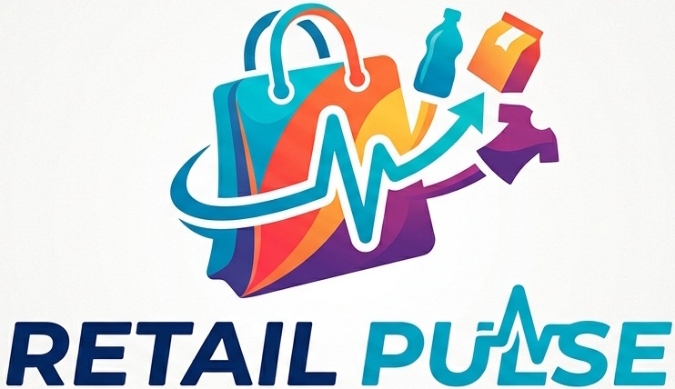
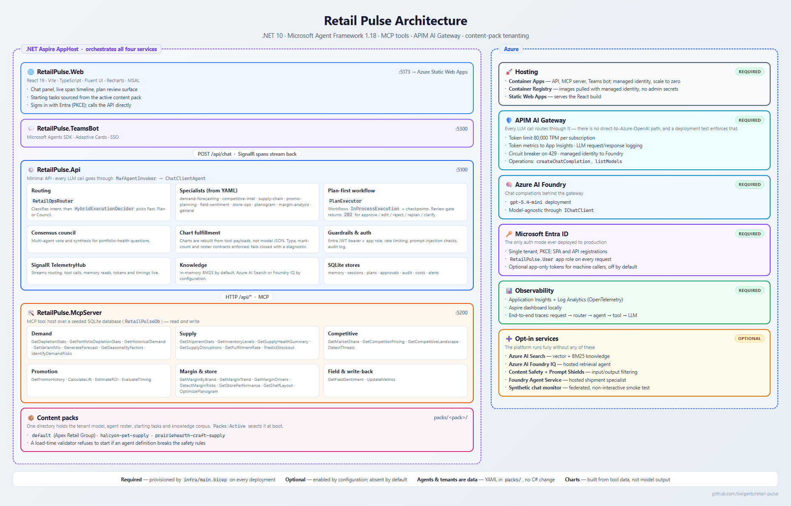

<div align="center">
  
</div>

# Retail Pulse

> AI-powered brand analytics for retail & consumer goods

[](https://dotnet.microsoft.com/)
[](https://react.dev/)
[](https://learn.microsoft.com/dotnet/aspire/)
[](https://github.com/swigerb/retail-pulse/actions/workflows/ci.yml)
[](LICENSE)

## Quick tour

<div align="center">

https://github.com/user-attachments/assets/741d0081-7631-4a04-8e51-3635c79290c2

</div>

<div align="center">
  <sub><strong>2 min 45 s</strong> &nbsp;·&nbsp; plays inline above &nbsp;·&nbsp; <a href="https://github.com/swigerb/retail-pulse/releases/download/media-v1/retail-pulse-sizzle.mp4">1080p60 original</a><br />
  A plain-English question routed to a specialist agent, charts generated live from real tool calls,
  real-time agent telemetry (routing, memory, traces), APIM as the AI Gateway enforcing token limits
  and cost accountability, and tenants configured in YAML.<br />
  Everything shown runs against the <code>default</code> content pack - Apex Retail Group, a fictional
  sample tenant. See the <a href="docs/demo-walkthrough.md">full demo script</a> for the long version.</sub>
</div>

## Guided walkthrough

<div align="center">

https://github.com/user-attachments/assets/7ddea518-926e-4c13-9c4b-62482a7d6675

</div>

<div align="center">
  <sub><strong>4 min 43 s</strong> &nbsp;·&nbsp; plays inline above &nbsp;·&nbsp; <a href="https://github.com/swigerb/retail-pulse/releases/download/media-v1/retail-pulse-demo-walkthrough.mp4">1080p60 original</a><br />
  One continuous recording of the app's built-in Demo Mode driving itself, with commentary on
  every step: a plain-English question and the token and cost readout for the answer, a chart
  rebuilt from the tool payload, the Health Council returning a split verdict, competitive
  intelligence, a P&amp;L waterfall recalculating as the brand changes, store operations, every
  brand scored across five specialist dimensions, knowledge search, the campaign planner, the
  guardrails dashboard, published Adaptive Cards, and the running bill.<br />
  Every prompt is submitted live against the deployed app, so the pauses are real API latency -
  some are trimmed and some are slowed so the commentary keeps pace.</sub>
</div>

## Overview

Retail Pulse is an AI brand-intelligence platform for retail and CPG. Ask a plain-English question about depletion trends, shipment dynamics, or field sentiment; a router hands it to the right specialist agent, which calls live MCP tools and answers with charts built from the returned data.

The backend is .NET 10 on the Microsoft Agent Framework, orchestrated by .NET Aspire. Multi-domain questions run through a plan-first workflow that a reviewer can approve, edit, reject, replan, or send back for clarification. Every LLM call goes through Azure API Management acting as an AI Gateway.

**What makes it different**

- **Agents are data, not code.** Adding a specialist is a `packs/<pack>/agents.yaml` edit — no C# change. A load-time validator refuses to start the app if a definition breaks the safety rules.
- **Whole scenarios swap in one directory.** A content pack bundles the tenant model, agent roster, starting tasks, and knowledge corpus. Three ship with the repo: `default` (Apex Retail Group), `halcyon-pet-supply`, and `prairiehearth-craft-supply`.
- **Charts are built from tool data, not model output.** The model writes the prose; the pipeline reconstructs the chart from the tool payload and enforces chart type, minimum marks, and portfolio coverage. When the data can't support the chart, it says so instead of rendering something misleading.
- **Every step is visible.** A SignalR hub streams routing decisions, tool calls, memory reads, token usage, and timings to the dashboard while the answer is still forming.
- **Cloud extras are opt-in.** In-memory BM25 knowledge is the default, so a clone plus `dotnet build` demonstrates the platform. Azure AI Search, Foundry IQ, and Content Safety switch on by configuration.

The reasoning behind each choice is recorded in [`docs/adr/`](docs/adr).

**Built with:** .NET 10, .NET Aspire 13.4, Microsoft Agent Framework 1.18, Microsoft.Extensions.AI, Model Context Protocol, React 19 + Vite, Azure Container Apps, Azure Static Web Apps, Azure Bot Framework, and Azure API Management.

## Required vs Optional Azure Resources

Retail Pulse is designed to demo locally from a fresh clone without any optional cloud dependency. The table below is the authoritative "what must exist vs what is opt-in" for the platform itself; see [docs/deployment-azd.md](docs/deployment-azd.md) for the Bicep parameters that toggle each optional resource.

### Required (any deployment)

| Resource | Purpose | How it is provisioned |
|----------|---------|-----------------------|
| **Azure OpenAI + APIM AI Gateway** | Chat completions for every LLM call (router, specialists, planner, council). APIM enforces token-per-minute limits, emits usage metrics, and authenticates to Azure OpenAI with managed identity. | `infra/modules/apim.bicep` + `infra/modules/apim-openai-api.bicep`, verified live by `scripts/Verify-ApimAiGateway.ps1`. |
| **Azure Container Apps + Container Apps Environment** | Hosts `RetailPulse.Api`, `RetailPulse.McpServer`, and `RetailPulse.TeamsBot` with managed identities and scale-to-zero. | `infra/modules/container-apps-env.bicep`, `infra/modules/container-apps.bicep`. |
| **Azure Container Registry (Basic)** | Stores the three backend images. Container Apps pull with managed identity — no admin secrets. | `infra/modules/container-registry.bicep`. |
| **Azure Static Web Apps** | Serves the React/Vite build; the SPA calls the Container Apps API directly for long-running chat / SignalR. | `infra/modules/static-web-app.bicep`. |
| **Application Insights + Log Analytics** | OpenTelemetry sink for traces, metrics, and logs. | `infra/modules/monitoring.bicep`. |
| **Entra ID app registration** | The only auth mode ever deployed to production (`Authentication__Mode = Entra`, single-tenant, PKCE). | Created out of band by `scripts/Setup-EntraAuth.ps1` and checked by `scripts/Verify-EntraAuth.ps1`; the resulting ids are passed to `infra/main.bicep` as parameters. |

### Optional (opt-in — the platform still runs without any of them)

| Resource | Enables | Enabled by |
|----------|---------|------------|
| **Azure AI Search** | Vector + BM25 knowledge over your corpus. | `Knowledge:Provider:Mode=AzureAISearch` and `Knowledge:AzureAISearch:Endpoint` set. Default degradation is `FailLoud`; set `Degradation=FallbackToInMemory` to soft-fail. Provisioned by `infra/modules/ai-search.bicep`. |
| **Azure AI Foundry IQ (Azure AI Projects)** | Foundry-hosted retrieval agent. | `Knowledge:Provider:Mode=FoundryIQ` and `Knowledge:FoundryIQ:ProjectEndpoint` set. |
| **Azure AI Content Safety + Prompt Shields** | Prompt-injection + harmful-content filtering on inputs and outputs. | `Guardrails:ContentSafety:Enabled=true` and the endpoint / API version set. Provisioned by `infra/modules/content-safety.bicep`. |
| **Azure AI Foundry Agent Service** | Foundry-hosted persistent shipment specialist. | `FoundryAgent:Enabled=true` + project endpoint / agent name. |
| **Authenticated synthetic chat monitor** | Non-interactive smoke-test of the deployed authenticated `/api/chat` path against the curated chart-acceptance smoke set (issue #57). Auth is workload-identity federation only — there is NO client secret anywhere in the workflow, in GitHub Actions secrets, or in the repo. | Set the `RETAIL_PULSE_SYNTHETIC_ENABLED=true` repository variable plus `RETAIL_PULSE_SYNTHETIC_CLIENT_ID`, `RETAIL_PULSE_SYNTHETIC_TENANT_ID`, `RETAIL_PULSE_SYNTHETIC_API_ORIGIN`, and `RETAIL_PULSE_SYNTHETIC_API_RESOURCE`. The target API must additionally opt in to app-only tokens (`MicrosoftEntra:AllowAppOnlyTokens=true`, default `false` — see [docs/security.md](docs/security.md)); without it the monitor's token is rejected `403` by design. When unset the `.github/workflows/synthetic-monitor.yml` schedule + `workflow_dispatch` no-ops with a `::notice::` explanation and never turns CI red. Script: `scripts/Invoke-SyntheticChatMonitor.ps1`; offline self-test wired into CI. See [docs/testing/authenticated-synthetic-monitor.md](docs/testing/authenticated-synthetic-monitor.md). |
| **Azure Files durable mount** | Cross-replica persistence of the SQLite stores (`memory.db`, `approvals.db`, `sessions.db`, `plans.db`, `audit.db`, `costs.db`, `alerts.db`). | Currently blocked by tenant governance policy (see [docs/deployment-azd.md](docs/deployment-azd.md)); the deployed demo runs with `RETAIL_PULSE_ALLOW_EPHEMERAL_STORAGE=true`. |

> **Local demo (zero optional resources).** `dotnet build RetailPulse.slnx` succeeds with no
> optional cloud resource configured. `dotnet run --project src/RetailPulse.AppHost`
> then launches the full stack — see [Quick Start](#quick-start) for the
> `OpenAI:Endpoint` requirement, the pre-built frontend prerequisite (`npm ci`
> against the internal proxy), and the exact honest limits.

---

## Architecture



<sub>Source: [`docs/architecture-diagram.html`](docs/architecture-diagram.html) — edit that and re-screenshot to regenerate.</sub>

### Solution Architecture (6 projects + frontend)

| Project | Purpose |
|---------|---------|
| **RetailPulse.AppHost** | Aspire orchestrator — wires McpServer → Api → TeamsBot → Frontend |
| **RetailPulse.Api** | Minimal API, agent roster (router, specialists, planner, council) over Azure OpenAI via APIM, SignalR telemetry hub |
| **RetailPulse.McpServer** | MCP tool host — SQLite-backed depletions, shipments, competitive, promotion, margin, store, and sentiment tools (read + write) |
| **RetailPulse.Contracts** | Shared DTOs + tenant config model |
| **RetailPulse.ServiceDefaults** | OpenTelemetry, health checks, resilience defaults |
| **RetailPulse.TeamsBot** | Microsoft Agents SDK — calls the API, renders Adaptive Cards |
| **RetailPulse.Web** | React/Vite/TypeScript dashboard — Fluent UI, Recharts, SignalR, MSAL |

### Key Patterns

- **Content packs** (`packs/<pack>/`) bundle tenant model, agent roster, knowledge corpus, and starting tasks. `Packs:Active` selects one at boot; adding a specialist or a starting task is a YAML edit. See the [Tenant Configuration Guide](docs/tenant-configuration.md).
- **Shared agent invocation seam.** Every LLM call — router, specialists, planner, council — goes through `MafAgentInvoker` into a `ChatClientAgent` with `UseProvidedChatClientAsIs = true`, which preserves the function-invocation cap, OpenTelemetry, and MCP resilience decorators end to end. Proven by `MafPrimitivesCharacterizationTests`.
- **Hybrid execution admission.** `HybridExecutionDecider` picks Fast, Plan, or Council per turn from router confidence, detected intents, an explicit user override, and configured advisory phrases.
- **Plan-first with a review gate.** Multi-domain turns run through `PlanExecutor`, a `Microsoft.Agents.AI.Workflows.InProcessExecution` with framework checkpoints. With `PlanReview:Enabled=true`, `/api/chat` returns `202 Accepted` and the reviewer's approve / edit / reject / replan / clarify decision drives the workflow through a durable checkpoint store.
- **AI Gateway.** APIM fronts Azure OpenAI with token limiting (80,000 TPM per subscription), usage metrics, circuit breaking, and managed-identity auth. Deployed via Bicep, verified live by `Verify-ApimAiGateway.ps1`, and pinned by a deployment contract test so no direct-to-model path can be introduced.
- **Deterministic charts.** For an explicit chart request the pipeline rebuilds the `ChartSpec` from the turn's tool payloads rather than trusting model-authored JSON, enforcing chart type, minimum marks, and portfolio coverage. A model chart is kept only when nothing can be rebuilt and it clears the same floor; otherwise the reply fails closed with a chart-unavailable diagnostic.
- **Real-time telemetry.** A SignalR hub broadcasts agent spans to the frontend, so the dashboard shows live tool calls, agent thoughts, and timings.
- **Pluggable knowledge providers.** In-memory BM25 by default; Azure AI Search and Foundry IQ are opt-in via `Knowledge:Provider:Mode` and per-agent `use_knowledge_base` / `knowledge_base_name` bindings.
- **MCP tools.** Roughly thirty SQLite-backed retail tools across demand, supply, competitive, promotion, margin, store, and field-sentiment domains, shaped by the pack's tenant. Agents can **read and write** via `UpdateMetrics`.
- **Optional Foundry delegation.** Hand off to a persistent Azure AI Foundry agent for deeper shipment analysis when `FoundryAgent:Enabled=true`.
- **Frontend.** Single-page dashboard with chat, pack-sourced starting tasks, chart rendering, plan review, and a span timeline.

### Three-Tier Distribution Model

Retail Pulse is designed for industries using a Three-Tier distribution model (manufacturer → distributor → retailer). The AI agent can detect **pipeline clogs** - where shipments and sell-through diverge - and correlate them with field sentiment data.

---

## Quick Start

### Prerequisites

- [.NET 10 SDK](https://dotnet.microsoft.com/download/dotnet/10.0)
- [Node.js 20+](https://nodejs.org/) — required for the frontend build. The AppHost launches `npm ci` + `npm run dev` for `src/RetailPulse.Web` on startup, so an unusable npm environment blocks the full-stack demo.
- An **Azure OpenAI endpoint** (or an OpenAI-compatible endpoint). The API requires both `OpenAI:Endpoint` and a valid deployment name (`OpenAI:Deployment`) to start.

### 1. Clone the repo

```bash
git clone https://github.com/swigerb/retail-pulse.git
cd retail-pulse
```

### 2. Pick a content pack (or use the shipped `default` Apex Retail Group pack)

Retail Pulse ships three content packs under `packs/`:

- `default` — **Apex Retail Group** (multi-category retail conglomerate, 12 brands, 6 categories, 6 regions). Loaded by default.
- `halcyon-pet-supply` — a specialty pet-supply retailer example.
- `prairiehearth-craft-supply` — a craft-supply retailer example.

Each pack bundles its tenant model, agent roster (`agents.yaml`), starting tasks (`starting-tasks.yaml`), and knowledge corpus (`knowledge/*.md`) in one directory. Select a pack at boot with `Packs:Active`. See the [Tenant Configuration Guide](docs/tenant-configuration.md) for the schema and worked examples.

### 3. Set up Azure OpenAI credentials

The API needs an endpoint + deployment name; the API key falls back to `demo-key` in Development but the endpoint has no fallback and the deployment must resolve non-empty (a missing `OpenAI:Deployment` with a specialist that also has no `model` in `agents.yaml` will fail startup at `AzureOpenAIClient.GetChatClient("")`).

```bash
dotnet user-secrets set "OpenAI:Endpoint" "<your-azure-openai-or-apim-endpoint>" --project src/RetailPulse.Api
dotnet user-secrets set "OpenAI:Deployment" "<your-deployment-name>" --project src/RetailPulse.Api
dotnet user-secrets set "OpenAI:ApiKey" "<your-api-key>" --project src/RetailPulse.Api
```

> To point directly at Azure OpenAI (bypassing APIM), set `OpenAI:Endpoint` to the account URL. To route through the APIM AI Gateway, use the gateway URL emitted by `azd env get-values` after `azd provision`.

> **Every setting in one place:** [`src/RetailPulse.Api/appsettings.json`](src/RetailPulse.Api/appsettings.json)
> is the checked-in reference config — loaded in every environment and
> documenting all sections (`OpenAI`, `Packs`, `Knowledge`, `Guardrails`,
> `PlanPersistence`, `SessionPersistence`, `Approval`, `RealtimeResilience`,
> `ChatTimeout`, `Security`, `FoundryAgent`, `ToolCache`, `TokenPricing`,
> `Observability`, …) with safe defaults. Edit it directly for
> non-secret tweaks; keep real secrets in user-secrets, **not** in this
> committed file. For deployment, see
> [`appsettings.Production.json`](src/RetailPulse.Api/appsettings.Production.json),
> which lists the production surface with placeholders (supply secrets via
> environment variables or Azure Key Vault). Each service
> (`AppHost`, `McpServer`, `TeamsBot`) has its own committed
> `appsettings.json` documenting just that service's settings.

### 4. Run with Aspire

```bash
# Install frontend dependencies (first time only; reproducible, via the internal proxy)
cd src/RetailPulse.Web && npm ci && cd ../..

# Start the full stack
dotnet run --project src/RetailPulse.AppHost
```

### 5. Enable the formatting hooks

The repo ships versioned pre-commit and pre-push hooks under
[`.githooks/`](.githooks). The pre-commit hook runs `dotnet format
--verify-no-changes` on staged C# files (fast); the pre-push hook runs the
same whole-solution command CI runs, so the CI `lint` job is never the
first place a formatting failure shows up. Neither is enabled by `git
clone` — run the setup once per clone to install both:

```powershell
# Windows
pwsh scripts/setup-hooks.ps1
```

```bash
# Linux / macOS / Git Bash
./scripts/setup-hooks.sh
```

Equivalent one-liner:

```bash
git config core.hooksPath .githooks
```

Bypass a single commit with `git commit --no-verify` or a single push with
`git push --no-verify`. See
[docs/contributing.md](docs/contributing.md#pre-commit-and-pre-push-formatting-hooks)
for the full behaviour, guarantee boundaries, bypass guidance, and
line-ending troubleshooting.

### 6. Open the React dashboard

Navigate to [http://localhost:5173](http://localhost:5173) and start asking questions!

**Try these queries (using the Apex Retail Group sample tenant):**

**🥃 Spirits:**
- *"How is Sierra Gold Tequila performing in the Northeast?"*
- *"Analyze the shipment pipeline for Ridgeline Bourbon in the Midwest"*

**🛒 Grocery:**
- *"How are FreshMart depletions trending in the Northeast this quarter?"*
- *"Compare Harvest Table vs FreshMart sell-through rates by region"*

**🍔 Quick-Serve Restaurants:**
- *"How is Apex Grill performing in the Southwest this quarter?"*
- *"Compare Coastline Tacos vs Apex Grill depletions across all regions"*

**🏠 Home Improvement:**
- *"Show me Pinnacle Hardware depletion stats in the Midwest for Q1"*
- *"How is Summit Outdoor performing in the Southeast vs West Coast?"*

**📎 Office Supply:**
- *"How are ClearDesk depletions trending in the Northeast this quarter?"*

**🛋️ Furniture:**
- *"Show me Urban Living depletion trends across all regions this quarter"*
- *"Compare Foundry Home vs Urban Living performance in the West Coast"*

**📈 Chart Rendering (test all chart types):**
- *"Create a line chart showing Sierra Gold Tequila depletion trends across all regions"* → line chart
- *"Show me a bar chart comparing depletion velocity for all spirits brands in the Northeast"* → bar chart
- *"Create a pie chart showing market share breakdown for our grocery brands nationally"* → pie chart
- *"Show a grouped bar chart comparing FreshMart and Harvest Table across all regions"* → grouped bar
- *"Create a donut chart of Apex Grill variant mix in the Southwest"* → donut chart
- *"Show a horizontal bar chart ranking all brands by depletion growth rate"* → horizontal bar
- *"Create a table showing depletion stats for all home improvement brands by region"* → table
- *"Show a gauge chart for Pinnacle Hardware inventory health in the Midwest"* → gauge

### One-click setup

```powershell
# Windows
.\deploy\deploy.ps1

# Linux/Mac
./deploy/deploy.sh
```

> **Note:** Deployment scripts use user secrets for all credentials. No API keys are stored in source.

---

## Tenant Configuration

Retail Pulse loads a **content pack** at boot to configure the entire platform (see the **Content packs** reference table under [§ Configuration](#configuration) below). The active pack is selected by `Packs:Active` (default `default`) and the pack root by `Packs:Root` (default `packs`). `Program.cs` wires `PackTenantProvider(activePack)` as the `ITenantProvider`; the pack's `agents.yaml` is the roster consumed by `ConfiguredSpecialistAgent` + `MafAgentInvoker`. The legacy root `tenant.yaml` and `src/RetailPulse.Api/prompts.yaml` files are retained on disk for byte-equivalence comparison tests only — the runtime never reads them (see the "Legacy `tenant.yaml` and `prompts.yaml`" section in [`docs/tenant-configuration.md`](docs/tenant-configuration.md)).

The `tenant:` block inside `packs/<pack>/pack.yaml` follows the historical tenant schema — company, industry, brands, regions, theme — so the sample below is the shape the runtime actually reads:

```yaml
# packs/default/pack.yaml (excerpt — `tenant:` block)
tenant:
  company: "Apex Retail Group"
  industry: "Multi-Category Retail"
  brands:
    - name: "Sierra Gold Tequila"
      category: "Spirits"
      variants: ["Blanco", "Reposado", "Añejo", "Extra Añejo"]
      priceSegment: "Premium"
    - name: "FreshMart"
      category: "Grocery"
      variants: ["Organic Produce", "Bakery", "Deli", "Frozen"]
      priceSegment: "Standard"
    - name: "Apex Grill"
      category: "Quick-Serve Restaurant"
      variants: ["Burgers", "Chicken", "Breakfast", "Beverages"]
      priceSegment: "Standard"
    # ... 12 brands across 6 categories
  regions:
    - "Northeast"
    - "Southeast"
    - "Midwest"
    - "Southwest"
    - "West Coast"
    - "Pacific Northwest"
  theme:
    primaryColor: "#1B4D7A"
    accentColor: "#E8A838"
```

The shipped **Apex Retail Group** sample tenant (`packs/default`) demonstrates a multi-category retail conglomerate with **12 brands** across **6 categories**:

| Category | Brands |
|----------|--------|
| 🥃 Spirits | Sierra Gold Tequila, Ridgeline Bourbon, Summit Vodka |
| 🛒 Grocery | FreshMart, Harvest Table |
| 🍔 Quick-Serve Restaurants | Apex Grill, Coastline Tacos |
| 🏠 Home Improvement | Pinnacle Hardware, Summit Outdoor |
| 📎 Office Supply | ClearDesk |
| 🛋️ Furniture | Urban Living, Foundry Home |

All brands operate across **6 regions**: Northeast, Southeast, Midwest, Southwest, West Coast, and Pacific Northwest. The `halcyon-pet-supply` and `prairiehearth-craft-supply` packs ship as alternate scenarios; switch by setting `Packs:Active` at boot. See the [Tenant Configuration Guide](docs/tenant-configuration.md) for the full pack schema, live validation rules, and a worked example of adding a specialist by configuration only.

---

## Technology stack

| Layer | Technology | Version | Purpose |
|-------|-----------|---------|---------|
| **Orchestration** | .NET Aspire | 13.4.6 | Service discovery, health checks, dashboard |
| **Runtime** | .NET | 10 | Backend services |
| **Agent Framework** | Microsoft Agent Framework (`Microsoft.Agents.AI` + `.Abstractions` + `.OpenAI` + `.Workflows`) | 1.18.0 | `ChatClientAgent` for router/specialists/planner/council + `Microsoft.Agents.AI.Workflows.InProcessExecution` for plan-first orchestration. Contract test `MafPackageVersionContractTests` fails CI on downgrades. |
| **AI Middleware** | Microsoft.Extensions.AI | 10.9.0 | `IChatClient`, function invocation, OpenTelemetry — preserved end-to-end via `UseProvidedChatClientAsIs = true`. |
| **Model** | GPT-5.4-mini (via APIM AI Gateway) | — | Reasoning and natural language |
| **Tools** | Model Context Protocol (MCP) | — | Standardized tool access |
| **Data** | SQLite (Microsoft.Data.Sqlite) | — | Mutable tenant-seeded metrics store + durable session/plan/approval/audit stores |
| **Frontend** | React + Vite + TypeScript | 19 / 8 / 6 | Interactive dashboard |
| **UI Components** | Fluent UI React | 9.x | Design system |
| **Real-time** | SignalR | 10.x | Live telemetry streaming |
| **Foundry-hosted agents** | Azure AI Foundry Agent Service (optional) | — | Bespoke shipment specialist when `FoundryAgent:Enabled=true`. Foundry IQ knowledge is a separate opt-in provider. |
| **Observability** | OpenTelemetry + Aspire Dashboard | — | Distributed traces, metrics, logs |
| **Monitoring** | Azure Application Insights | — | Production telemetry and traces |
| **Gateway** | Azure API Management | — | Token metering, rate limiting, audit |
| **Backend hosting** | Azure Container Apps | — | Runs the API, MCP Server, and Teams Bot as containers; scales to zero when idle |
| **Frontend hosting** | Azure Static Web Apps | — | Serves the React/Vite static build; most REST requests use the linked Container Apps backend, while long-running chat and SignalR connect directly to the authenticated Container Apps API |
| **Container registry** | Azure Container Registry (Basic) | — | Stores backend images; Container Apps pull them with managed identity (no admin secrets) |
| **Testing** | xUnit + Vitest | — | Backend + frontend tests |

---

## Project Structure

```
retail-pulse/
├── tenant.yaml                       # Legacy sample tenant (byte-equivalent to packs/default's tenant: block) — no longer read at runtime
├── RetailPulse.slnx                  # Solution file
├── packs/                            # Content packs (issue #108) — active runtime source of tenant + agents + knowledge
│   ├── default/                      # Apex Retail Group sample (loaded by default)
│   │   ├── pack.yaml                 # Tenant metadata (brands, regions, theme) + pack manifest
│   │   ├── agents.yaml               # Agent roster (specialist prompts, model, tools, knowledge bindings)
│   │   ├── starting-tasks.yaml       # Suggested starting prompts surfaced by the SPA
│   │   ├── knowledge/                # Grounding corpus (indexed by the active knowledge provider)
│   │   └── seed/scenario.yaml        # Deterministic SQLite seed data
│   ├── halcyon-pet-supply/           # Alternate sample: specialty pet-supply retailer
│   └── prairiehearth-craft-supply/   # Alternate sample: craft-supply retailer
├── src/
│   ├── RetailPulse.AppHost/          # Aspire 13.4.6 orchestrator
│   ├── RetailPulse.Api/              # Agent API service
│   │   ├── Agents/                   # MAF agent implementation
│   │   ├── Caching/                  # MCP response cache (DelegatingHandler)
│   │   ├── Consensus/                # Multi-agent council orchestration
│   │   ├── Health/                   # Readiness/liveness health checks
│   │   ├── Hubs/                     # SignalR telemetry hub (session-scoped groups)
│   │   ├── Middleware/               # Exception handling, correlation ID, security headers, auth
│   │   ├── Prompts/                  # PromptTemplateEngine (tenant hydration)
│   │   ├── Security/                 # Audit log, security services
│   │   ├── Telemetry/                # Custom business metrics (OpenTelemetry)
│   │   ├── Tools/                    # MCP tool wrappers
│   │   ├── Validation/               # Input validation (ChatRequestValidator)
│   │   └── prompts.yaml              # Legacy prompts file (mirrored to packs/default/agents.yaml; no longer read at runtime)
│   ├── RetailPulse.McpServer/        # MCP server (data tools)
│   │   ├── Tools/                    # MCP tool definitions (parameterized queries)
│   │   └── Data/                     # SQLite-backed tenant-driven metrics
│   ├── RetailPulse.Contracts/        # Shared models (immutable config, ChartSpec, etc.)
│   │   └── ValueObjects/             # BrandName, Region, SessionId
│   ├── RetailPulse.ServiceDefaults/  # Shared Aspire defaults (OTel, health, resilience)
│   ├── RetailPulse.TeamsBot/         # Microsoft Teams bot (JWT-validated, Adaptive Cards)
│   └── RetailPulse.Web/              # React/Vite/TypeScript frontend
│       ├── src/components/           # ChatPanel, SpanTimeline, Charts, ErrorBoundary
│       └── src/hooks/                # SignalR connection, telemetry
├── tests/
│   ├── RetailPulse.Tests/            # xUnit + integration tests (~3,465 passing)
│   ├── RetailPulse.LoadTests/        # NBomber load test scenarios
│   └── RetailPulse.Benchmarks/       # BenchmarkDotNet performance suite
├── deploy/                           # Deployment & infrastructure
│   ├── deploy.ps1 / deploy.sh        # One-click local deployment scripts
│   ├── apim-ai-gateway/              # APIM AI Gateway Bicep (main.bicep, policy.xml)
│   ├── foundry-agent/                # Foundry agent deployment
│   └── generate-traffic.ps1          # Load testing
├── infra/                            # Azure infrastructure (Bicep, used by azd)
│   ├── main.bicep                    # Subscription-scoped orchestrator
│   └── modules/                      # Monitoring, Container Apps Env, Container Apps, Container Registry, Static Web App
├── azd-hooks/                        # Azure Developer CLI lifecycle hooks
├── azure.yaml                        # Azure Developer CLI project file
└── docs/                             # Documentation
```

---

## Features

### Teams Integration

Retail Pulse can be deployed as a **Microsoft Teams bot** with Adaptive Card responses, SSO authentication, and chart visualizations rendered inline.

See [Teams Setup Guide](docs/teams-setup.md) for step-by-step instructions.

### Charts & Visualizations

Charts are rendered **client-side**. The LLM emits structured `ChartSpec` JSON and each client renders natively:

- **Web UI** - Interactive [Recharts](https://recharts.org/) SVG charts
- **Teams** - Native Adaptive Card chart elements

**9 chart types:** line, bar, grouped bar, stacked bar, horizontal bar, pie, donut, gauge, and table. See [Chart Rendering Guide](docs/chart-rendering.md).

### APIM AI Gateway

Retail Pulse routes all LLM traffic through an [Azure API Management](https://learn.microsoft.com/azure/api-management/api-management-key-concepts) instance provisioned as first-class IaC by `azd up`. The AI Gateway applies token-per-minute rate limits, emits token-usage metrics, authenticates to Azure AI Foundry with a managed identity, and captures full request/response traces. See [AI Gateway Integration](docs/ai-gateway-integration.md).

See [Official Microsoft resources](docs/ai-gateway-integration.md#official-microsoft-resources) for canonical links, including [AI gateway capabilities in Azure API Management](https://learn.microsoft.com/en-us/azure/api-management/genai-gateway-capabilities) and the [Azure-Samples/AI-Gateway](https://github.com/Azure-Samples/AI-Gateway) sample repo.

### Foundry Shipment Agent (Optional)

Deploy a specialist agent to Azure AI Foundry for Three-Tier Distribution pipeline analysis. Disabled by default - the app runs fully without it using a local analyzer. See [Architecture](docs/architecture.md).

### Enterprise Hardening

Retail Pulse implements enterprise-grade patterns:

- **Resilience** — Circuit breaker (5 failures/30s), retry with exponential backoff + jitter, dead-letter queue
- **Observability** — Correlation IDs, custom OpenTelemetry metrics, SLO/SLI definitions, health checks
- **Security** — CSP/HSTS/X-Frame-Options headers, input validation, SHA256 hash-chain audit log
- **Performance** — MCP response cache, keyword fast-path routing, lightweight council voting, cache warming
- **API Versioning** — No URL-based versioning. The API surface is unversioned (`/api/*`) and evolves via additive, backwards-compatible changes; breaking changes require a coordinated deprecation with the SPA.
- **Testing** — 3,200+ unit/integration/contract/E2E tests across backend (xUnit) and frontend (Vitest), plus load tests, mutation testing, and benchmarks

---

## Demo Walkthrough

Watch the [2 min 45 s quick tour](#quick-tour) for the short version, or the
[4 min 43 s narrated walkthrough](#guided-walkthrough) to see every panel. The
[complete demo script](docs/demo-walkthrough.md) is a step-by-step presentation guide (~10 minutes).

---

## Azure Deployment

### Azure Developer CLI (`azd up`) — Recommended

The fastest way to deploy Retail Pulse to Azure:

```bash
azd auth login
azd up
```

This deploys:
- **Backend** (API, MCP Server, Teams Bot) → Azure Container Apps. Each app runs under a system-assigned managed identity and scales to zero when idle.
- **Frontend** (React/Vite static build) → Azure Static Web Apps. The build injects the Container Apps API origin, so the SPA calls the API directly and opens the SignalR telemetry connection against that origin. The Static Web App also links the API as its `/api` backend, so relative `/api/*` calls stay same-origin.
- **Container images** → a dedicated Azure Container Registry (Basic). Container Apps pull images with their managed identities, so no registry admin secrets are stored.
- **Monitoring** → Application Insights + Log Analytics

See [docs/deployment-azd.md](docs/deployment-azd.md) for full documentation.

### APIM AI Gateway

The primary AI Gateway is provisioned by `azd up` as part of `infra/main.bicep` via:

- `infra/modules/apim.bicep` — Developer-tier APIM instance, managed identity, service diagnostics, and loggers
- `infra/modules/apim-openai-api.bicep` — Azure OpenAI backend, inference API, policy, API diagnostics, subscription, and cross-RG RBAC

Every `azd provision` / `azd up` runs a **mandatory** post-provision AI Gateway verifier
(`scripts/Verify-ApimAiGateway.ps1`, invoked from `azd-hooks/postprovision.ps1` and
`postprovision.sh`) that inspects the live APIM resource, API, policy, backend,
diagnostics, and ACA wiring via ARM REST. A live invariant failure fails the whole
`azd up`, so a successful deployment cannot silently ship with a broken gateway.
Coverage is locked in by the deployment-side contract tests
(`tests/RetailPulse.Tests/Deployment/`), which include a compiled-ARM graph check
(`CompiledArmDeploymentGraphTests`) that runs `az bicep build` and asserts the
compiled JSON — not just the Bicep source — still declares the gateway.

`deploy/apim-ai-gateway/` now only contains optional attach-on templates for wiring
additional MCP/A2A APIs onto an **already-existing** APIM instance in a separate
workflow — it does not provision the primary gateway.

### Infrastructure Security

- Bicep outputs do not expose secrets or APIM subscription keys
- Diagnostic settings (App Insights, Log Analytics) are deployed alongside resources
- Application Insights connection strings are configured in the AppHost, not checked into `appsettings.json`

---

## CI/CD

[](https://github.com/swigerb/retail-pulse/actions/workflows/ci.yml)

The CI pipeline runs on every push and PR to `main`:

| Job | What it does |
|-----|-------------|
| **build** | Restore, build, test (.NET 10) with coverage |
| **frontend** | `npm ci` (from the committed lockfile, via the internal package feed proxy), build, vitest |
| **security** | Check for vulnerable NuGet packages |
| **provider-matrix** | Auth provider matrix: `npm ci` + frontend build/meta gate, and the backend Security + Deployment suites emitted to TRX with a conservative count gate (`scripts/Test-BackendAuthMatrix.ps1`) |
| **lint** | Verify code style (`dotnet format --verify-no-changes`) |
| **bicep** | Compile every Bicep module transitively from `infra/main.bicep` via `az bicep build` — cheapest possible regression gate for the APIM AI Gateway / Container Apps contract; uploads the compiled ARM template as an artifact |
| **verify-script-selftest** | `Verify-ApimAiGateway offline self-test` — runs `scripts/Verify-ApimAiGateway.ps1 -SelfTest` (no Azure signin, no live APIM traffic) to lock in the shape and header/body contracts of the live-verification script itself so a broken script can't silently pass a live deploy |
| **synthetic-monitor-selftest** | Offline regression fence for the OPTIONAL authenticated synthetic chat monitor (issue #57) — runs `scripts/Invoke-SyntheticChatMonitor.ps1 -SelfTest` and then re-invokes the script with no configuration to prove it exits 0 with a `SKIP:` message. No Azure signin, no live traffic, no credential — the whole surface is federation-only |

### Run locally

```bash
# Full backend build + test
dotnet build RetailPulse.slnx
dotnet test RetailPulse.slnx --verbosity quiet

# Frontend
cd src/RetailPulse.Web && npm run build && npx vitest run

# Load tests (optional)
cd tests/RetailPulse.LoadTests && dotnet run -c Release

# Benchmarks (optional)
dotnet run -c Release --project tests/RetailPulse.Benchmarks
```

---

## Security

| Area | Implementation |
|------|---------------|
| **API Authentication** | Auth middleware on all API endpoints; provider-neutral mode contract (`Authentication__Mode` = `Entra`/`GitHub`/`Anonymous`, fail-closed) — see [ADR-005](docs/adr/005-provider-neutral-authentication.md) |
| **Frontend sign-in** | Provider-neutral SPA: build-time `VITE_AUTH_MODE` (mirrors the API mode) renders exactly one sign-in UX; fail-closed resolver; session tokens are `sessionStorage`-only and cleared on logout/expiry/401/403. See [FRONTEND.md](docs/FRONTEND.md#authentication--sign-in-provider-neutral) and the [authentication matrix](docs/authentication-matrix.md). |
| **Teams Bot** | JWT token validation on incoming activities |
| **MCP Server** | Parameterized SQL queries (no string interpolation) |
| **SignalR** | Telemetry scoped to session groups (no cross-session leakage) |
| **Secrets** | App Insights keys in AppHost only; user secrets for API keys |
| **Frontend** | CSP headers, URL scheme validation in Adaptive Cards |
| **Sessions** | 2-hour TTL with automatic eviction via `SessionManager` |
| **Config** | Immutable config classes (`IReadOnlyList`) with input validation |

---

## Authentication Modes

Retail Pulse is **provider-neutral**: a single build-time selector picks exactly one sign-in
provider for both the API (`Authentication__Mode`) and the SPA (`VITE_AUTH_MODE`), which **must
match** for a deployment (a deployment contract test enforces the parity). Resolution is
**fail-closed** — an unknown, missing, or cross-provider configuration refuses to start rather
than silently downgrading. See [ADR-005](docs/adr/005-provider-neutral-authentication.md) and the
[authentication matrix](docs/authentication-matrix.md) for the authoritative behavior.

| Mode | Live/prod? | Sign-in UX | Identity & token | Surface |
|------|-----------|-----------|------------------|---------|
| **Entra** | ✅ **Production default (pinned)** | Microsoft Entra single-tenant (MSAL, PKCE, no secret) | In-process JWT bearer validation; normalized principal | Full app (chat, telemetry, charts, SignalR, observability) |
| **GitHub** | ⛔ Opt-in, **non-production** | "Continue with GitHub" confidential OAuth **BFF** | GitHub token stays server-side; SPA holds a short-lived Retail Pulse **session** token only | Full app for allow-listed users; REST + hubs |
| **Anonymous** | ⛔ Opt-in, **non-production** | "Continue in limited demo" | Server-minted anonymous session; no external IdP | **Read-only chat only** — two-route surface (`POST /api/chat` + anonymous session bootstrap); everything else 403; no SignalR |

### Production status

The live environment is **always Entra**, and this is enforced across every layer:
`appsettings`, `infra/main.bicep` (`output VITE_AUTH_MODE = 'Entra'`), the `azd` env/params/hooks,
and the Static Web App frontend build are all explicitly `Entra`. GitHub and Anonymous are
**never deployed** by the standard pipeline — they require a **separate, explicit, non-production
build** with their own complete configuration. `azd up` never provisions them.

### Build each mode (safe, synthetic, no secrets)

Auth mode is injected at build time. Locally, leave the variables **unset** for the Development
synthetic auth handler. To exercise a specific mode, provide the public build-time values
(never secrets — the GitHub client secret and session key live only on the backend):

```bash
# Entra (production mode) — requires valid tenant/client ids or the build fails fast:
VITE_AUTH_MODE=Entra VITE_ENTRA_TENANT_ID=<tenant-guid> VITE_ENTRA_CLIENT_ID=<client-guid> \
  npm --prefix src/RetailPulse.Web run build

# GitHub (opt-in, non-production) — mode + API origin, no Entra ids:
VITE_AUTH_MODE=GitHub VITE_API_ORIGIN=https://<api-host> \
  npm --prefix src/RetailPulse.Web run build

# Anonymous (opt-in, non-production) — mode + API origin, no Entra ids:
VITE_AUTH_MODE=Anonymous VITE_API_ORIGIN=https://<api-host> \
  npm --prefix src/RetailPulse.Web run build
```

The `prebuild` gate (`scripts/validate-auth-config.mjs`) **fails an Entra build with
missing/placeholder ids**, passes GitHub/Anonymous with just the mode, and rejects unknown modes.

### Provider build/test matrix

A repeatable, secret-free matrix builds all three modes with **synthetic public identifiers** and
asserts the fail-closed cases plus the immutable auth-mode meta marker (only Entra satisfies the
production predicate). It also runs in CI (`provider-matrix` job — no secrets; installs run
`npm ci` through the internal proxy and never mutate the committed lockfile):

```bash
# Frontend: config gate for every mode + real Entra/GitHub/Anonymous builds with the
# emitted-index.html auth-mode meta behavioral assertion:
npm --prefix src/RetailPulse.Web run test:provider-matrix
# ...or run only the fast config gate (skip the full builds):
npm --prefix src/RetailPulse.Web run test:provider-matrix:gate

# Full backend + frontend matrix orchestrator:
pwsh scripts/Test-ProviderMatrix.ps1            # backend TRX count gate + frontend gate + builds
pwsh scripts/Test-ProviderMatrix.ps1 -Full      # frontend legacy flag (all three modes build regardless)

# Backend matrix alone, with the machine-readable TRX + conservative count gate (>=400, zero failures):
pwsh scripts/Test-BackendAuthMatrix.ps1
```

### Verify the live production posture (read-only)

After a deployment, confirm the live environment is Entra-only and fail-closed. This script is
**strictly read-only** — it never obtains, prints, or logs a token/secret, never signs you in,
and never mutates a resource; it exits non-zero on any mismatch:

```pwsh
# Preview exactly what it checks, contacting nothing:
pwsh scripts/Verify-ProductionAuth.ps1 -TenantId <guid> -ClientId <guid> -ResourceGroup <rg> -WhatIf

# Run against the live environment (requires an existing `az login` with reader access):
pwsh scripts/Verify-ProductionAuth.ps1 -TenantId <guid> -ClientId <guid> -ResourceGroup <rg>
```

It asserts the live SWA root carries the immutable `retail-pulse-auth-mode` meta marker set to
exactly `Entra` (empty/non-200/missing/malformed fails), and that ACA Easy Auth is observed
disabled (an undetermined state fails closed). Use `-SkipHttpProbes` to skip only the live API
status probes, or `-SkipSpaInspection` to skip only the SWA marker check — they are independent.

It verifies the target tenant/subscription/RG, the API revision health and Entra env pins
(`ASPNETCORE_ENVIRONMENT=Production`, `Authentication__Mode=Entra`, `Security__RequireAuth=true`,
matching tenant/client ids, ephemeral-storage acknowledgement, **no** `Anonymous__*`/`GitHub__*`
vars), ACA Easy Auth disabled, the anonymous `401` surface + `health/alive` `200`s, the SWA serving
an Entra build (GitHub/Anonymous **not** exposed), and the Entra app registration posture
(single-tenant, no password credential, scope+role, SP `assignmentRequired`).

### Limitations (GitHub & Anonymous)

- **Non-production only** — neither is ever deployed live; there is **no live deployment** for them.
- **Single replica / replica-local** — session and one-time stores are in-memory, so these modes are
  pinned to **max 1 replica** (state does not survive scale-out or restart).
- **Anonymous is read-only** — chat only, rate-limited and billable; telemetry, observability,
  streaming, exports, approvals, memory, and all operator views are hidden client-side and gated
  server-side. No SignalR hub runs.
- **GitHub** requires a confidential OAuth app and an allow-list; the provider token never reaches
  the browser.

---

## Real-Time Telemetry

The SignalR `TelemetryHub` streams agent execution spans to connected clients in real time. Clients join **session-scoped groups** so telemetry is isolated per conversation.

**What gets streamed:**
- Agent thought process and reasoning steps
- MCP tool calls with arguments and results
- Token usage and cost estimates (per-model pricing in `appsettings.json`)
- Timing data for each span

The React dashboard renders these as an interactive span timeline alongside the chat panel.

### Navigation and feature flags

Every secondary view is gated behind a `VITE_FEATURE_*` build-time flag, so a
deployment can narrow the surface it exposes. The flags default to `false`
(except Observability) for a minimal local build; copy
`src/RetailPulse.Web/.env.example` to `.env.local` to turn them on.

The **deployed demo environment enables all of them** — `infra/main.bicep` emits
every `VITE_FEATURE_*` as an infra output so the Vite build embeds `true`, and
`ContainerAppDeploymentContractTests` pins the corresponding API-side switches.

Because ten views do not fit in one header row, the navigation is data-driven:
the first four stay inline and the rest collapse into a **More** menu. The active
view is always promoted out of the overflow so you can see where you are and
click the same button to return to chat.

Panels are individually fault-isolated. Each secondary view renders inside a
`PanelErrorBoundary`, so an uncaught error is contained to that panel instead of
replacing the whole dashboard — the header stays usable and navigating away
resets the boundary.

---

## Configuration

### User Secrets & core configuration

`src/RetailPulse.Api/appsettings.json` is the checked-in reference config with safe defaults for every section. The table below is a per-surface quick reference; edit `appsettings.json` for non-secret tweaks and keep secrets in user-secrets or environment variables.

| Setting | Key | Default | Purpose |
|---------|-----|---------|---------|
| API Key | `OpenAI:ApiKey` | *(Development falls back to `demo-key`)* | Bearer credential passed to the OpenAI-compatible endpoint. |
| LLM Endpoint | `OpenAI:Endpoint` | *(required, no fallback)* | Azure OpenAI account URL or APIM AI Gateway URL. Startup fails if unset. |
| Deployment Name | `OpenAI:Deployment` | *(must resolve non-empty)* | Deployment / model name for the default agent when the pack does not override `agents.<key>.model`. |
| API Version | `OpenAI:ApiVersion` | `2025-03-01-preview` | Azure OpenAI REST API version. |
| Active Pack | `Packs:Active` | `default` | Content pack selected at boot. Values: any directory name under `packs/`. |
| Pack Root | `Packs:Root` | `packs` | Filesystem root scanned for content packs. |
| Knowledge Provider | `Knowledge:Provider:Mode` | `InMemory` | `InMemory` (BM25, no cloud dep) \| `AzureAISearch` \| `FoundryIQ`. |
| Knowledge Degradation | `Knowledge:Provider:Degradation` | `FailLoud` | `FailLoud` \| `FallbackToInMemory` when the optional cloud provider is unreachable. |
| Azure AI Search Endpoint | `Knowledge:AzureAISearch:Endpoint` | *(empty)* | Enables the Azure AI Search knowledge provider when set. |
| Foundry IQ Project | `Knowledge:FoundryIQ:ProjectEndpoint` | *(empty)* | Enables the Foundry IQ knowledge provider when set. |
| Content Safety | `Guardrails:ContentSafety:Enabled` | `false` | Opt-in Prompt Shields + harmful-content classification. |
| Agent-def guardrails | `Guardrails:AgentDefinition:OnValidationFailure` | `RefuseStartup` (prod) | Load-time validator; refuses startup on any violation in prod. |
| Plan persistence | `PlanPersistence:Enabled` | `false` | Enables `/api/plans/*`, plan review, `HybridExecutionDecider` plan path. |
| Session persistence | `SessionPersistence:Enabled` | `false` | Enables `/api/sessions/*` durable conversation store. |
| SignalR heartbeat | `RealtimeResilience:ApplicationHeartbeatEnabled` | `true` | Server-side keep-alive tick emitted by the telemetry hub. |
| Fast timeout | `ChatTimeout:SingleShot` | `00:01:30` | Hard timeout for a single-shot chat turn. |
| Plan timeout | `ChatTimeout:Plan` | `00:06:00` | Hard timeout for a full plan execution. |
| MCP Server URL | `McpServer:BaseUrl` | `http://localhost:5200` | Local MCP server address. |
| Foundry Enabled | `FoundryAgent:Enabled` | `false` | Enables the bespoke Foundry shipment specialist. |
| Foundry Project | `FoundryAgent:ProjectEndpoint` | *(set by deploy script)* | Azure AI Foundry project endpoint. |
| Foundry Agent | `FoundryAgent:ShipmentAgentName` | `Distribution Analysis Specialist` | Persistent agent name. |
| App Insights | `APPLICATIONINSIGHTS_CONNECTION_STRING` | *(set in AppHost)* | Distributed traces + custom metrics sink. |

### Content packs (`packs/<pack>/`)

Retail Pulse loads a **content pack** at boot (`Packs:Active`, default `default`) instead of a single monolithic `tenant.yaml`. A pack bundles the tenant model, agent roster, starting tasks, and knowledge corpus in one directory so a whole scenario can be swapped in place. Changes take effect on restart — no code changes required.

| File | Purpose |
|------|---------|
| `pack.yaml` | Pack manifest: id, display name, industry, company, brands, regions, channels, theme, distribution model. Injected into agent system prompts. |
| `agents.yaml` | Specialist roster: keys, intents, model, temperature, tool bindings, `use_knowledge_base` / `knowledge_base_name`. Adding a specialist is an edit here. |
| `starting-tasks.yaml` | Suggested chat prompts surfaced by the SPA. |
| `knowledge/*.md` | Grounding corpus indexed by the active knowledge provider (default InMemory BM25). |
| `seed/scenario.yaml` | Optional deterministic seed data for the SQLite store. |

See the [Tenant Configuration Guide](docs/tenant-configuration.md) for the full schema, live validation rules, and a worked example of adding a specialist by configuration only.

## Ports

| Service | Port | URL |
|---------|------|-----|
| React Frontend | 5173 | http://localhost:5173 |
| Retail Pulse API | 5100 | http://localhost:5100 |
| MCP Server | 5200 | http://localhost:5200 |
| Teams Bot | 5300 | http://localhost:5300 |
| Aspire Dashboard | dynamic | See terminal output for login URL |

---

## Tests

**4,200+ tests passing** across xUnit (.NET backend, 3,465 tests) and Vitest (frontend, 779 tests), plus NBomber load scenarios and BenchmarkDotNet benchmarks. Covers agent routing and telemetry, chart fulfillment and tool behaviour, prompt/pack configuration, tenant validation, session management, SignalR broadcasting, Teams Adaptive Card builders, security and auth policy, and performance profiling.

```bash
# Run all .NET tests
dotnet test

# Run frontend tests
cd src/RetailPulse.Web && npm test
```

See [Testing Guide](docs/testing-guide.md) for manual testing options and test scenarios.

---

## Contributing

1. Fork the repository
2. Create a feature branch (`git checkout -b feature/amazing-feature`)
3. Commit your changes (`git commit -m 'Add amazing feature'`)
4. Push to the branch (`git push origin feature/amazing-feature`)
5. Open a Pull Request

---

## License

MIT - see [LICENSE](LICENSE) for details.

This project is for demonstration purposes. All data is fictional, seeded from the active content pack (`packs/<Packs:Active>/pack.yaml` + `packs/<Packs:Active>/seed/scenario.yaml`), and does not represent actual business data.
