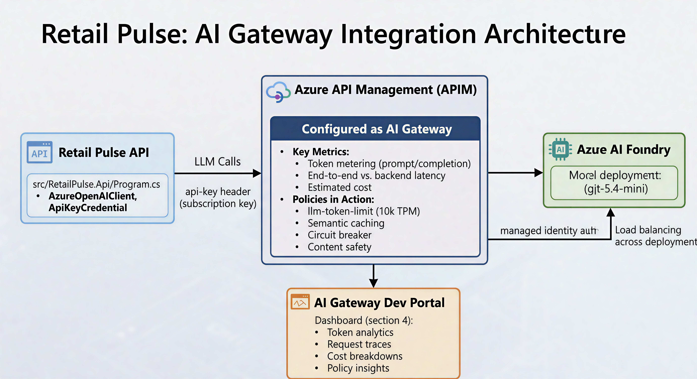
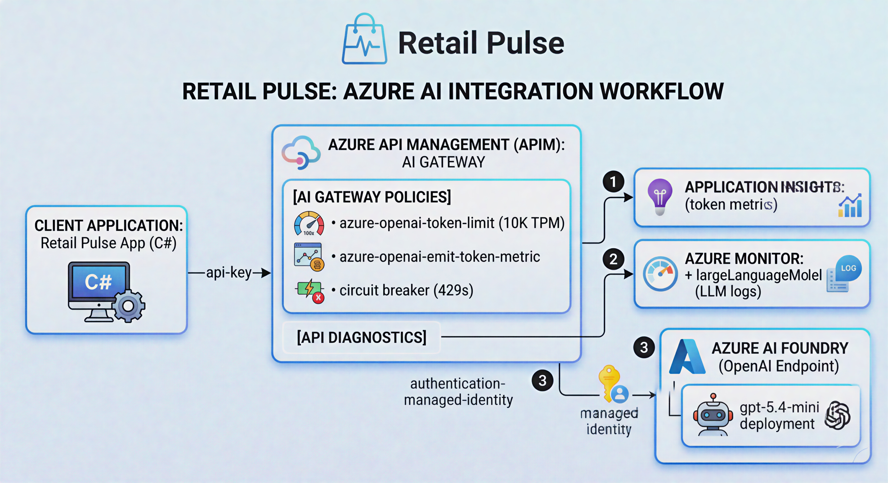

# AI Gateway Integration

## Overview

Patron Pulse routes all LLM calls through Azure API Management (APIM) configured as an **AI Gateway**. This provides:

- **Token metering and cost attribution** per request
- **Rate limiting and quota management** (tokens per minute)
- **Full request/response tracing** with prompt/completion capture
- **Circuit breaker** protection against 429 throttling
- **Managed identity authentication** — no AI model keys in application code

The AI Gateway pattern places APIM between the Patron Pulse API and Azure AI Foundry, giving operators visibility and control over every LLM interaction.

## Architecture



### AI Gateway Request Pipeline



## Deployment

The APIM AI Gateway infrastructure is defined in `deploy/apim-ai-gateway/` and deployed via Bicep:

```powershell
.\deploy\apim-ai-gateway\deploy-apim-api.ps1 -SetUserSecrets
```

This deploys:

| File | Purpose |
|------|---------|
| `main.bicep` | Inference API, backend, policies, **diagnostics**, and subscription |
| `policy.xml` | AI Gateway policies (token rate limiting, token metrics, MI auth) |
| `openai-spec.json` | Azure OpenAI API spec imported into APIM |
| `role-assignment.bicep` | Managed identity role assignment (APIM → Azure AI Foundry) |

---

## Observability: The Three Telemetry Layers

Getting full analytics (Requests, Tokens, Performance, Availability) in the AI Gateway Dev Portal requires **three distinct telemetry layers**. Missing any one of them results in blank dashboards.

### Layer 1: Instance-Level Diagnostic Settings

**What it provides:** Performance, Availability, and gateway-level logs.

The APIM instance must send its logs to a Log Analytics workspace. Configure this under **Monitoring → Diagnostic settings** in the Azure Portal.

**Required categories:**

| Category | Table | Purpose |
|----------|-------|---------|
| `GatewayLogs` | `ApiManagementGatewayLogs` | All HTTP requests (status codes, latency, IPs) |
| `GatewayLlmLogs` | `ApiManagementGatewayLlmLog` | LLM-specific data (tokens, model, prompts) |

> **Important:** The `GatewayLlmLogs` category (labeled "Generative AI gateway logs" in the Portal) must be **explicitly checked**. The default "all logs" setting often misses it.

### Layer 2: API-Level Application Insights Diagnostic

**What it provides:** Token usage metrics in `customMetrics`.

Each API must have Application Insights diagnostics enabled **at the API level** (not just the instance level). This is configured as a child resource of the API.

```bicep
resource apiAppInsightsDiagnostics 'Microsoft.ApiManagement/service/apis/diagnostics@2024-06-01-preview' = {
  parent: api
  name: 'applicationinsights'
  properties: {
    loggerId: appInsightsLogger.id
    sampling: {
      samplingType: 'fixed'
      percentage: 100        // Use 100% for demos; reduce in production
    }
    verbosity: 'information'  // Must be 'information', not 'error'
    logClientIp: true
  }
}
```

> **Gotcha:** Setting verbosity to `'error'` hides successful request data. Always use `'information'` for analytics.

### Layer 3: API-Level Azure Monitor Diagnostic with `largeLanguageModel`

**What it provides:** Populates the `ApiManagementGatewayLlmLog` table — the primary data source for the AI Gateway Dev Portal.

**This is the critical piece that is not documented in most guides.** Without it, APIM treats LLM traffic as generic HTTP and never writes to the `ApiManagementGatewayLlmLog` table.

When you use the Azure Portal's "Add API → Azure OpenAI Service" tile, it automatically creates an API-level diagnostic with the `largeLanguageModel` property. When deploying programmatically (Bicep, ARM, CLI), you **must** create this diagnostic explicitly.

```bicep
resource apiLlmDiagnostics 'Microsoft.ApiManagement/service/apis/diagnostics@2024-06-01-preview' = {
  parent: api
  name: 'azuremonitor'
  properties: {
    loggerId: azureMonitorLogger.id
    alwaysLog: 'allErrors'
    sampling: {
      samplingType: 'fixed'
      percentage: 100
    }
    logClientIp: true
    #disable-next-line BCP037
    largeLanguageModel: {
      logs: 'enabled'          // THE TRIGGER — tells APIM to parse LLM traffic
      requests: {
        maxSizeInBytes: 32768  // Capture prompt content (up to 32 KB)
        messages: 'all'        // Log all messages (system, user, assistant)
      }
      responses: {
        maxSizeInBytes: 32768  // Capture completion content (up to 32 KB)
        messages: 'all'
      }
    }
  }
}
```

> **Why `#disable-next-line BCP037`?** The `largeLanguageModel` property is not yet in the public Bicep type definitions. The pragma suppresses the "unknown property" warning. The property is fully supported by the ARM API at version `2024-05-01` and later.

#### What `largeLanguageModel` does

When `logs` is set to `'enabled'`, APIM shifts from treating the API as a "black-box JSON pipe" to actively **parsing the request/response bodies as LLM traffic**. This enables:

- Extraction of token counts (prompt, completion, total) from the response body
- Identification of the model name and deployment
- Capture of prompt and completion message content (subject to `maxSizeInBytes`)
- Population of the `ApiManagementGatewayLlmLog` table in Log Analytics

Without this property, the `GatewayLlmLogs` diagnostic category at the instance level has nothing to write — the gateway never generates LLM log records.

#### Setting this via CLI (without Bicep)

If you need to enable LLM logging on an existing API without redeploying:

```bash
az rest --method PUT \
  --uri "https://management.azure.com/subscriptions/{sub}/resourceGroups/{rg}/providers/Microsoft.ApiManagement/service/{apim}/apis/{apiId}/diagnostics/azuremonitor?api-version=2024-05-01" \
  --body '{
    "properties": {
      "loggerId": "/subscriptions/{sub}/resourceGroups/{rg}/providers/Microsoft.ApiManagement/service/{apim}/loggers/azuremonitor",
      "alwaysLog": "allErrors",
      "sampling": { "samplingType": "fixed", "percentage": 100 },
      "largeLanguageModel": {
        "logs": "enabled",
        "requests": { "maxSizeInBytes": 32768, "messages": "all" },
        "responses": { "maxSizeInBytes": 32768, "messages": "all" }
      }
    }
  }'
```

### Telemetry Summary

| Dashboard Metric | Policy / Setting | Destination Table |
|------------------|-----------------|-------------------|
| **Tokens** | `azure-openai-emit-token-metric` policy | App Insights: `customMetrics` |
| **Requests** | `largeLanguageModel` diagnostic | Log Analytics: `ApiManagementGatewayLlmLog` |
| **Performance** | Standard diagnostic logging | Log Analytics: `ApiManagementGatewayLogs` |
| **Availability** | Instance-level diagnostic settings | Log Analytics: `ApiManagementGatewayLogs` |

---

## AI Gateway Policies

The policies in `deploy/apim-ai-gateway/policy.xml`:

| Policy | Section | Description |
|--------|---------|-------------|
| `set-backend-service` | inbound | Routes to the Azure AI Foundry backend |
| `authentication-managed-identity` | inbound | Authenticates to backend via APIM managed identity |
| `azure-openai-token-limit` | inbound | Rate limits to 10,000 TPM per subscription |
| `azure-openai-emit-token-metric` | inbound | Emits token usage to App Insights `customMetrics` |
| Circuit breaker (on backend) | — | Trips on 429 responses for 1 minute |

> **Policy naming:** Use `azure-openai-*` policies (not `llm-*`) when the backend is Azure OpenAI or Azure AI Foundry. The `azure-openai-*` variants are required for proper GenAI log integration.

### Streaming (SSE) Considerations

If your API uses streaming responses (`stream: true`), token counts may be missing from the response body unless the client includes:

```json
{ "stream_options": { "include_usage": true } }
```

Without this flag, Azure OpenAI omits the `usage` block from the final SSE chunk, and the `azure-openai-emit-token-metric` policy has nothing to report.

---

## How the App Connects

In `src/RetailPulse.Api/Program.cs`, the `AzureOpenAIClient` points at APIM:

```csharp
var openAiEndpoint = builder.Configuration["OpenAI:Endpoint"]
    ?? "https://bsapim-dev-northcentralus-001.azure-api.net/inference";
var openAiApiKey = builder.Configuration["OpenAI:ApiKey"] ?? "demo-key";

var azureClient = new AzureOpenAIClient(
    new Uri(openAiEndpoint),
    new ApiKeyCredential(openAiApiKey));
```

The `ApiKey` is the **APIM subscription key** (not an Azure OpenAI key). APIM authenticates to the backend using its own managed identity — no AI model keys are stored in or transit through the application.

### URL Pattern

```
POST {apim_gateway}/inference/openai/deployments/{model}/chat/completions?api-version={version}
```

Example:
```
POST https://bsapim-dev-northcentralus-001.azure-api.net/inference/openai/deployments/gpt-5.4-mini/chat/completions?api-version=2024-10-21
```

---

## Setup Steps

### 1. Prerequisites

Before deploying, ensure your APIM instance has:

- **Managed identity** enabled (system-assigned)
- **Azure Monitor logger** named `azuremonitor` (auto-created by APIM)
- **Application Insights logger** named `appinsights-logger` (linked to your App Insights instance)
- **Diagnostic settings** with `GatewayLogs` and `GatewayLlmLogs` categories enabled, sending to a Log Analytics workspace

### 2. Deploy the APIM AI Gateway

```powershell
cd deploy/apim-ai-gateway
.\deploy-apim-api.ps1 -SetUserSecrets
```

This creates the inference API, backend, policies, **both diagnostic resources** (Application Insights + Azure Monitor with `largeLanguageModel`), and the subscription.

### 3. Configure Patron Pulse

If you used `-SetUserSecrets`, this is done automatically. Otherwise:

```bash
dotnet user-secrets set "OpenAI:ApiKey" "<your-apim-subscription-key>" --project src/RetailPulse.Api
dotnet user-secrets set "AiGateway:SubscriptionKey" "<your-apim-subscription-key>" --project src/RetailPulse.Api
```

> **Bypass APIM:** To go direct to Azure AI Foundry (e.g., for debugging):
> ```bash
> dotnet user-secrets set "OpenAI:Endpoint" "https://<your-ai-foundry>.services.ai.azure.com/api/projects/<project>/openai/v1" --project src/RetailPulse.Api
> ```

### 4. Verify Analytics

After sending requests through APIM, wait 10–15 minutes for Log Analytics ingestion, then run this KQL query in your Log Analytics workspace:

```kql
ApiManagementGatewayLlmLog
| where TimeGenerated > ago(1h)
| project TimeGenerated, ApiId, ModelId, TotalTokens, PromptTokens, CompletionTokens
| order by TimeGenerated desc
```

If this returns rows, the AI Gateway Dev Portal will display analytics. If it returns nothing, check:

1. The API has the `azuremonitor` diagnostic with `largeLanguageModel.logs = 'enabled'`
2. The instance-level diagnostic settings include the `GatewayLlmLogs` category
3. Sampling is set to 100% (not a lower percentage)

### 5. Use AI Gateway Dev Portal

The `ai-gateway-dev-portal/` directory contains a clone of the [Azure AI Gateway Dev Portal](https://github.com/Azure-Samples/ai-gateway-dev-portal). This portal queries `ApiManagementGatewayLlmLog` to display:

- **Requests** — LLM request history with model, tokens, and latency
- **Tokens** — usage trends per consumer, API, and time period
- **Performance** — latency percentiles and throughput
- **Availability** — success/failure rates and error breakdowns

---

## Troubleshooting Checklist

If the AI Gateway Dev Portal shows no data, verify each layer:

| # | Check | How to verify |
|---|-------|--------------|
| 1 | **Instance diagnostic settings** | Azure Portal → APIM → Monitoring → Diagnostic settings → `GatewayLlmLogs` category is checked |
| 2 | **API-level `azuremonitor` diagnostic** | `az rest --method GET --url ".../apis/{apiId}/diagnostics/azuremonitor"` → `largeLanguageModel.logs` = `"enabled"` |
| 3 | **API-level `applicationinsights` diagnostic** | `az rest --method GET --url ".../apis/{apiId}/diagnostics/applicationinsights"` → exists with 100% sampling |
| 4 | **`azure-openai-emit-token-metric` policy** | Check `policy.xml` is applied to the API's inbound section |
| 5 | **Backend connectivity** | Send a test request through APIM → expect HTTP 200 with `usage` in the response body |
| 6 | **`ApiManagementGatewayLlmLog` table** | KQL query (above) returns rows. New tables can take 15–30 minutes to appear after first data ingestion |
| 7 | **Sampling rate** | Under heavy load with low sampling, analytics appear sparse. Use 100% for demos |

### Common Pitfalls

| Pitfall | Symptom | Fix |
|---------|---------|-----|
| Missing `largeLanguageModel` diagnostic | `ApiManagementGatewayLlmLog` table doesn't exist | Add `azuremonitor` diagnostic with `largeLanguageModel: { logs: 'enabled' }` |
| Using `llm-*` policies instead of `azure-openai-*` | Token metrics don't appear | Switch to `azure-openai-token-limit` and `azure-openai-emit-token-metric` |
| App Insights verbosity set to `'error'` | Only failed requests appear | Set verbosity to `'information'` |
| Streaming without `include_usage` | Token counts are zero | Add `stream_options: { "include_usage": true }` to client requests |
| `max_tokens` parameter | 400 Bad Request from newer models | Use `max_completion_tokens` instead |

---

## Configuration Reference

| Setting | Description | Default |
|---|---|---|
| `OpenAI:Endpoint` | APIM gateway URL for inference API | `https://bsapim-dev-northcentralus-001.azure-api.net/inference` |
| `OpenAI:ApiKey` | APIM subscription key | _(required)_ |
| `AiGateway:Enabled` | Enable APIM header injection | `false` |
| `AiGateway:SubscriptionKeyHeader` | Header name for the APIM subscription key | `Ocp-Apim-Subscription-Key` |
| `AiGateway:SubscriptionKey` | APIM subscription key value | _(empty)_ |
| `AiGateway:TraceEnabled` | Add `Ocp-Apim-Trace: true` header for request tracing | `false` |

## Demo Flow

When presenting Patron Pulse with the AI Gateway integration:

1. **Show Patron Pulse dashboard** — demonstrate the agent working with real-time telemetry via SignalR.
2. **Switch to AI Gateway Dev Portal** — show the same requests from APIM's perspective.
3. **Highlight key metrics:**
   - Token counts (prompt + completion) per request
   - End-to-end latency vs. backend latency
   - Estimated cost per request
4. **Show observability layers:**
   - Aspire Dashboard — distributed traces from the app
   - AI Gateway Dev Portal — token analytics and LLM request logs from APIM
   - Azure Portal — diagnostic settings and Log Analytics queries
