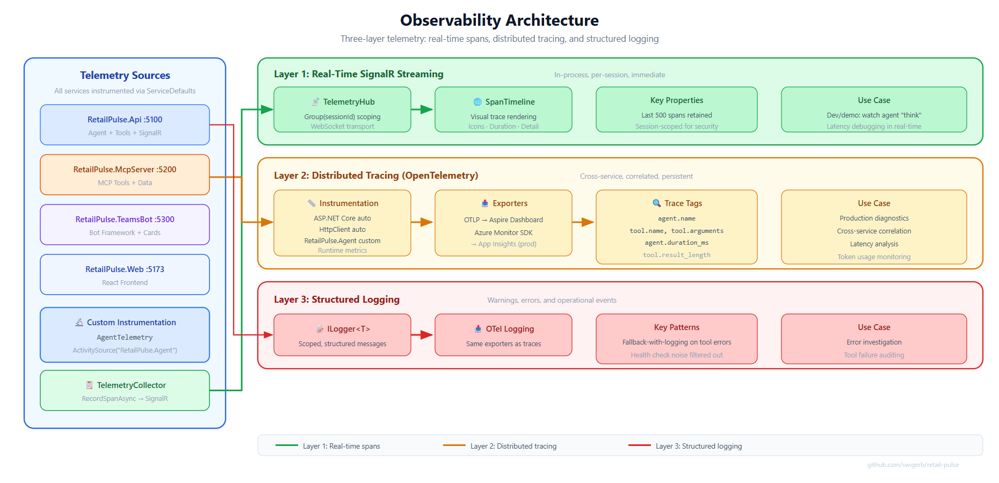

# Patron Pulse — Architecture

> Technical architecture for the Patron Pulse agentic analytics platform

---

## Component Diagram


---

## Data Flow

### Request Flow: User Question → Answer


### Telemetry Flow: Agent → Dashboard


---

## Technology Choices & Rationale

### .NET Aspire — Orchestration & Observability

| Decision | Rationale |
|----------|-----------|
| **Why Aspire over Docker Compose?** | Single `dotnet run` starts everything. Type-safe resource definitions in C#. Built-in dashboard with no YAML configuration. Same definitions work locally and deploy to Azure Container Apps. |
| **Why not Kubernetes locally?** | Unnecessary complexity for a demo. Aspire abstracts container orchestration while still supporting K8s deployment in production. |
| **Service defaults pattern** | `AddServiceDefaults()` ensures every service gets OpenTelemetry, health checks, resilience, and service discovery with one line. Consistency without boilerplate. |

### Microsoft Agent Framework (MAF) — AI Agent

| Decision | Rationale |
|----------|-----------|
| **Why MAF over LangChain/Semantic Kernel?** | Native .NET integration. Built on `Microsoft.Extensions.AI` abstraction — works with any `IChatClient` implementation. OpenTelemetry tracing is built in, not bolted on. |
| **Why GPT-5.4-mini?** | Best balance of reasoning quality, speed, and cost for tool-calling scenarios. Architecture is model-agnostic — swap via `prompts.yaml`. |
| **Prompt configuration in YAML** | Separates prompt engineering from code. Non-developers can iterate on prompts without touching C#. Supports multiple agent definitions. |

### Model Context Protocol (MCP) — Tool Access

| Decision | Rationale |
|----------|-----------|
| **Why MCP over direct HTTP calls?** | MCP is an emerging standard. Today's tools are simulated; tomorrow, swap to real APIs without changing agent code. Any MCP-compatible agent can use these tools. |
| **REST + MCP dual endpoints** | MCP SSE for agent communication. REST endpoints (`/api/depletion-stats`) for direct testing and integration. Same backing data, two access patterns. |
| **Simulated data** | Enables demo without real data dependencies. Rich enough to show realistic patterns (growth leaders, declining brands, overstocked inventory). |

### React + Vite + TypeScript — Frontend

| Decision | Rationale |
|----------|-----------|
| **Why React over Blazor?** | Broader ecosystem for rapid UI development. SignalR client library works seamlessly. Most frontend developers know React. |
| **SignalR for telemetry** | Real-time span streaming without polling. WebSocket transport for low latency. Graceful fallback to Server-Sent Events. |
| **Component architecture** | `ChatPanel` (input/output), `TelemetryPanel` (metrics), `SpanTimeline` (visual trace) — each independently testable. |

### Azure API Management — AI Gateway

| Decision | Rationale |
|----------|-----------|
| **Why APIM for AI?** | Token metering per team/department. Rate limiting prevents runaway costs. Content safety policies. Complete audit trail for compliance. |
| **Separate from core demo** | The app works without APIM. Gateway is an enterprise overlay — add it when the conversation turns to production governance. |

---

## Observability Architecture



### Span Hierarchy Example

**Default (Foundry disabled):**

```
HTTP POST /api/chat (ASP.NET Core)
└── RetailPulseAgent.ChatAsync
    ├── thought (agent reasoning)
    ├── IChatClient.CompleteAsync (LLM call)
    ├── tool_call: GetShipmentStats
    │   └── HTTP GET /api/shipment-stats (HttpClient → MCP Server)
    ├── tool_result: GetShipmentStats
    ├── tool_call: GetDepletionStats
    │   └── HTTP GET /api/depletion-stats (HttpClient → MCP Server)
    ├── tool_result: GetDepletionStats
    ├── IChatClient.CompleteAsync (synthesis call)
    └── response (final answer)
```

**With Foundry Shipment Agent enabled (`FoundryAgent:Enabled: true`):**

```
HTTP POST /api/chat (ASP.NET Core)
└── RetailPulseAgent.ChatAsync
    ├── thought (agent reasoning)
    ├── IChatClient.CompleteAsync (LLM call)
    ├── agent_delegation: FoundryShipmentAgent
    │   ├── tool_call: GetShipmentStats
    │   │   └── HTTP GET /api/shipment-stats (HttpClient → MCP Server)
    │   ├── tool_result: GetShipmentStats
    │   ├── agent_call: FoundryShipmentAgent.Analyze
    │   │   └── IChatClient.CompleteAsync (Foundry LLM call)
    │   └── agent_response: pipeline analysis result
    ├── tool_call: GetDepletionStats
    │   └── HTTP GET /api/depletion-stats (HttpClient → MCP Server)
    ├── tool_result: GetDepletionStats
    ├── IChatClient.CompleteAsync (synthesis call)
    └── response (final answer)
```

---

## APIM AI Gateway Pattern

Patron Pulse uses Azure API Management as an AI Gateway following the [Azure-Samples/AI-Gateway](https://github.com/Azure-Samples/AI-Gateway) pattern.

### Request Flow

1. **RetailPulse API** sends chat completion requests to APIM using the Azure OpenAI SDK
2. **APIM** validates the `api-key` header (subscription key)
3. **AI Gateway policies** apply:
   - `llm-token-limit`: Rate limits to 10,000 tokens per minute per subscription
   - `llm-emit-token-metric`: Emits token usage metrics to Azure Monitor (namespace: RetailPulse)
   - Circuit breaker: Trips on 429s for 1 minute
4. **APIM** forwards to Azure AI Foundry using its managed identity (no keys in transit)
5. **Azure AI Foundry** processes with the `gpt-5.4-mini` deployment

### URL Pattern

```
POST {apim_gateway}/inference/openai/deployments/{model}/chat/completions?api-version={version}
```

Example:
```
POST https://bsapim-dev-northcentralus-001.azure-api.net/inference/openai/deployments/gpt-5.4-mini/chat/completions?api-version=2025-03-01-preview
```

### Why APIM as AI Gateway?

| Capability | Value |
|-----------|-------|
| **Token Rate Limiting** | Prevent runaway costs — cap TPM per consumer |
| **Token Metrics** | Monitor token usage in Azure Monitor / App Insights |
| **Managed Identity** | No API keys in application code |
| **Circuit Breaker** | Graceful degradation when backend is throttled |
| **Centralized Governance** | One gateway for all AI model access |
| **Dev Portal** | Self-service API key management for consumers |

---

## Security Considerations

| Concern | Mitigation |
|---------|-----------|
| API key storage | User secrets locally; Azure Key Vault in production |
| API key in transit | HTTPS enforced; APIM terminates TLS |
| Prompt injection | Agent has constrained system prompt; tools only return structured data |
| Data access | MCP server can enforce row-level security per user/role |
| Audit trail | OpenTelemetry traces + APIM logs capture every interaction |
| Rate limiting | APIM token-per-minute and request-per-second policies |
| Content safety | APIM content filtering policies (Azure AI Content Safety) |

---

## Deployment Topology

### Local Development

```
dotnet run --project src/RetailPulse.AppHost
  └── Launches:
      ├── RetailPulse.Api (:5100)
      ├── RetailPulse.McpServer (:5200)
      ├── RetailPulse.Web (:5173)
      └── Aspire Dashboard (dynamic port)
```

### Azure Production (Target)

```
Azure Container Apps Environment
├── RetailPulse.Api (Container App)
├── RetailPulse.McpServer (Container App)
├── RetailPulse.Web (Static Web App or Container App)
│
├── Azure API Management (AI Gateway)
│   └── OpenAI backend with policies
│
├── Azure Monitor / Application Insights
│   └── OTLP exporter target
│
└── Azure Key Vault
    └── OpenAI keys, connection strings
```
