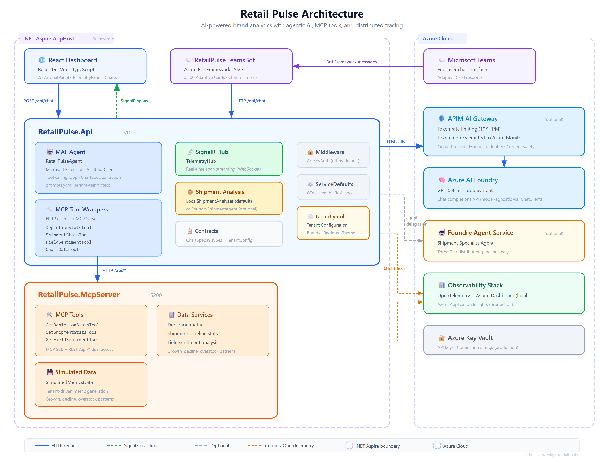
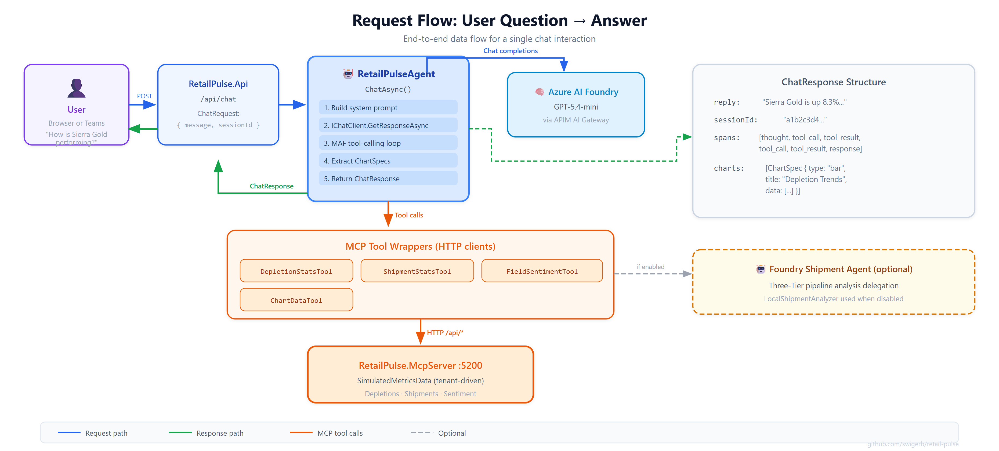
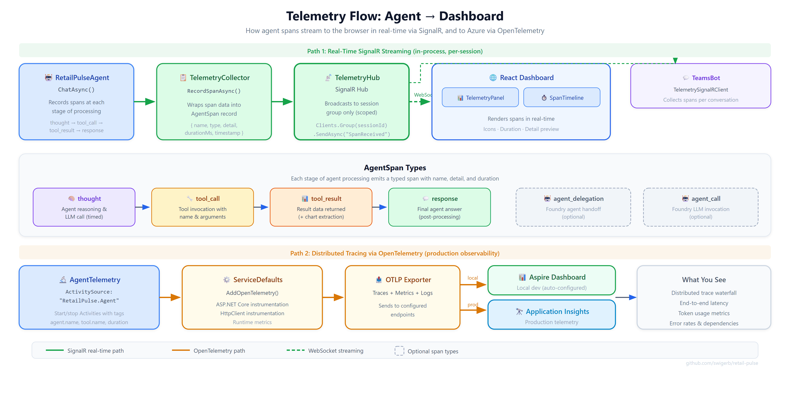
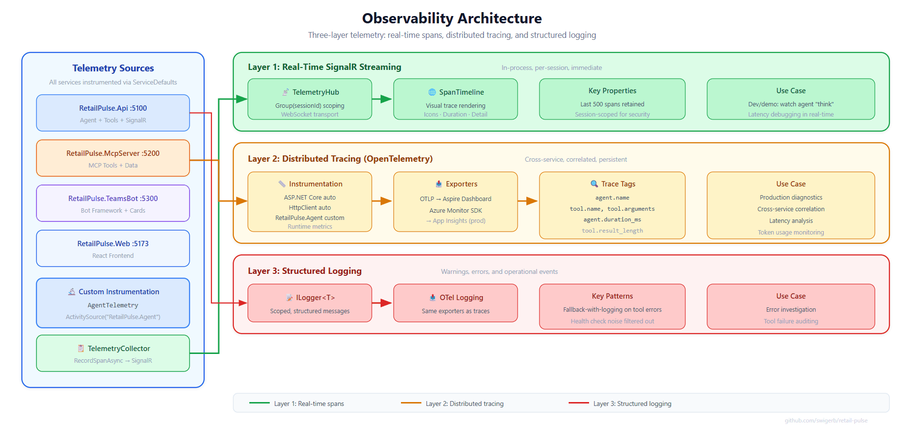
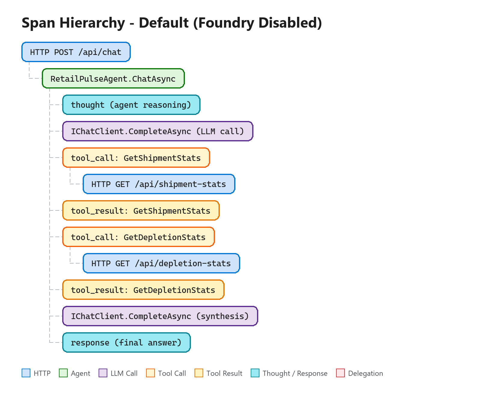
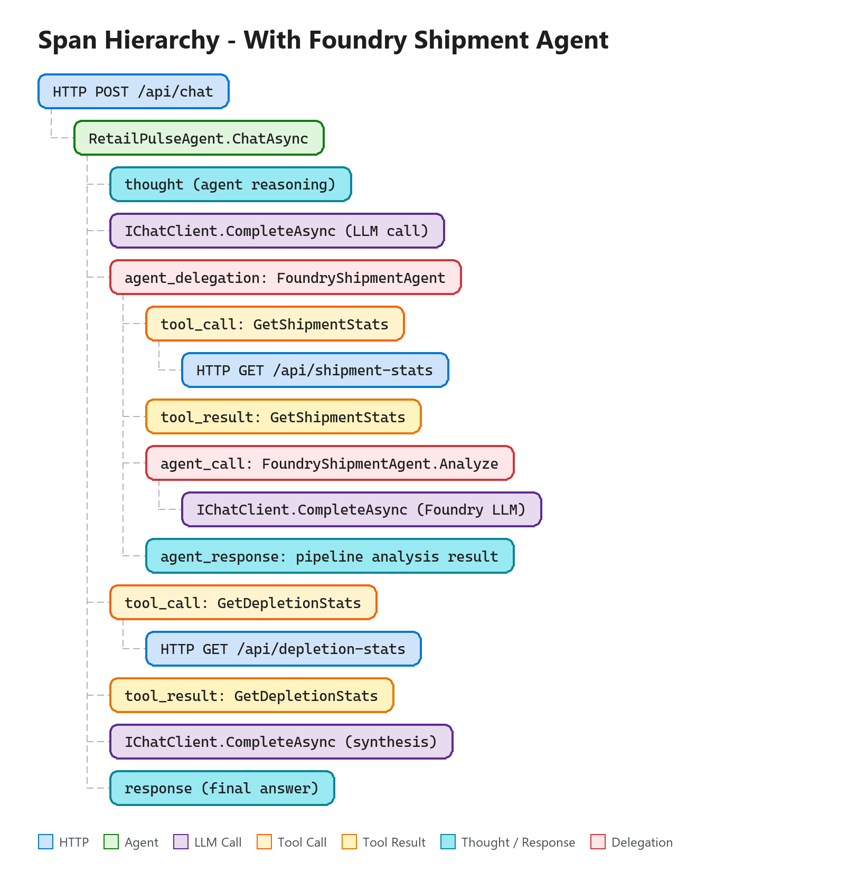
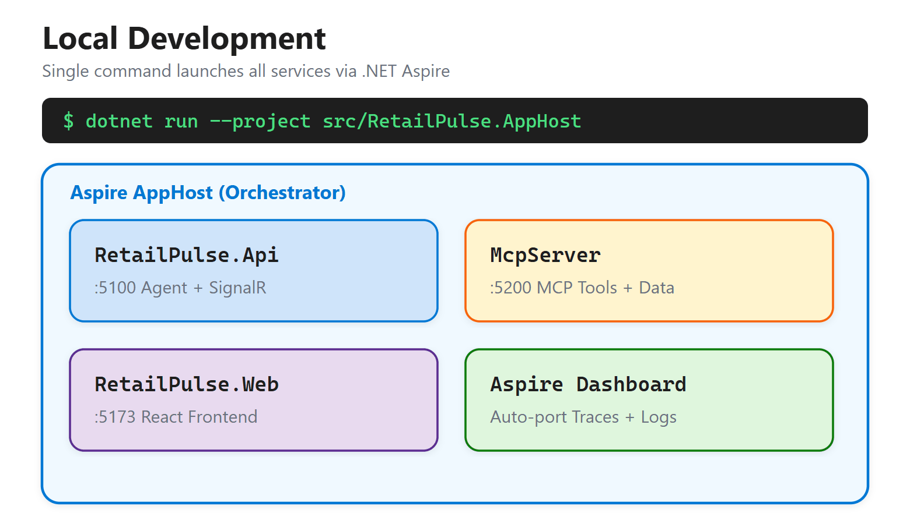
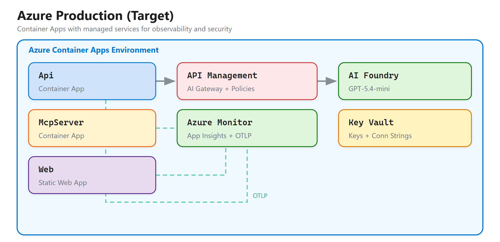

# Retail Pulse — Architecture

> Technical architecture for the Retail Pulse agentic analytics platform

---

## Component Diagram



The component diagram shows the five-service architecture orchestrated by .NET Aspire:

- **React Frontend** — Chat UI, telemetry dashboard, agent routing indicators, streaming message display, collaborative cards
- **RetailPulse API** — Composition root with endpoint group extensions (`Endpoints/*.cs`), multi-agent router pipeline, guardrails/cache/streaming middleware, bounded telemetry and memory channels, rate limiting (4 tiers), observability suite (cost tracking, audit log, conversation export)
- **MCP Server** — REST + MCP dual endpoints for all domain tools (depletions, shipments, sentiment, demand, promo, competitive, store ops, margin), SQLite data store with deterministic seeding from `tenant.yaml`
- **Teams Bot** — Adaptive Card rendering, SSO via `TeamsSsoHandler` with `StrictTenantValidation`, configurable health checks (`HealthMode: fail-fast | degraded`), `DevelopmentAuthHandler` bypass in local dev
- **Aspire AppHost** — Non-containerized orchestration, OpenTelemetry, service discovery, health endpoints

---

## Data Flow

### Request Flow: User Question → Answer



### Telemetry Flow: Agent → Dashboard



### Data Flow: Agent Analyzing Data

When a user asks a question like *"Compare depletion trends across all regions"*, the agent orchestrates a multi-step data flow across four services. Here is the complete lifecycle:

```
Browser (ChatPanel) → POST /api/chat → RetailPulseAgent
  → Azure OpenAI (via APIM AI Gateway) → model selects tools
  → MAF tool-calling loop → API proxy tools → MCP Server
  → RetailPulseDb (SQLite) → results back up the chain
```

#### Step-by-Step Flow

| Step | Component | What Happens |
|------|-----------|-------------|
| **1. User sends message** | `ChatPanel.tsx` | Frontend sends `POST /api/chat` with `{ message, sessionId, history }`. Conversation history (up to 10 turns) is included for context continuity. |
| **2. Agent builds prompt** | `RetailPulseAgent.cs` | Assembles a message array: system prompt (from `prompts.yaml`) + conversation history + current user message. Starts a `Stopwatch` to measure wall-clock duration. |
| **3. Model inference** | Azure OpenAI via APIM | The `IChatClient` (backed by `AzureOpenAIClient`) sends the messages to APIM. APIM applies token limiting (default **80,000 TPM** per subscription — configurable via the `tokensPerMinute` param in `infra/modules/apim-openai-api.bicep`), emits metrics, and forwards to Azure OpenAI using managed identity. Model: `gpt-5.4-mini` (shipped deployment `gpt-5.4-mini-2026-03-17`). |
| **4. Tool selection** | Azure OpenAI | The model examines the user's question and the available tool schemas, then decides which tools to call and with what parameters. For a portfolio-wide question, it may call `GetPortfolioDepletionStats`; for a single brand, `GetDepletionStats`. |
| **5. Tool execution loop** | MAF (`UseFunctionInvocation`) | Microsoft.Extensions.AI middleware intercepts each tool call. It invokes the registered `AITool` implementation, captures the result, and sends it back to the model. The model may call additional tools or generate its final response. Tools execute sequentially within a single turn. |
| **6. API proxy call** | e.g., `DepletionStatsTool.cs` | Each tool is an HTTP proxy. It calls the MCP Server's REST endpoint (e.g., `GET /api/depletion-stats?brand=X&region=Y&period=Z`). If the MCP Server is unreachable, the tool returns hardcoded fallback data and logs a warning. |
| **7. Data retrieval** | `RetailPulseDb.cs` | The MCP Server's singleton SQLite service queries (or updates) the data. Data is seeded from `tenant.yaml` configuration (12 brands, 6 regions, 3 channels) using deterministic algorithms. The `UpdateMetrics` tool can also write to the database, enabling real-time data mutations by the agent. |
| **8. Response assembly** | `RetailPulseAgent.cs` | After the model produces its final text response, the agent packages it with telemetry spans, chart data (if any), and `TotalDurationMs` (from the `Stopwatch`). |
| **9. Frontend rendering** | `ChatPanel.tsx` | The response is displayed as formatted markdown. Charts render via `ChartRenderer` (Recharts). Telemetry spans stream to `TelemetryPanel` via SignalR for real-time display. |

#### Where the Data Resides

| Data | Location | Persistence |
|------|----------|-------------|
| **Depletion metrics** (sales velocity, YoY trends, inventory) | `RetailPulseDb` → SQLite `Depletions` table, keyed by `(Brand, Region)` | On disk (`data/retailpulse.db`). Seeded from `tenant.yaml` on first run; persists AI mutations across restarts. |
| **Shipment data** (distribution, fill rates) | `RetailPulseDb` → SQLite `Shipments` table | Same as above. |
| **Field sentiment** (rep feedback, scores) | `RetailPulseDb` → SQLite `Sentiment` table | Same as above. |
| **Tenant configuration** (brands, regions, channels) | `tenant.yaml` at repo root → loaded by `FileTenantProvider` | On disk. Single source of truth for the business domain. Changing this file triggers a database re-seed on next restart. |
| **Conversation history** | Frontend state (`ChatPanel.tsx`) → sent with each request | Browser session only. Not persisted server-side. |
| **Telemetry spans** | Frontend state (`Dashboard.tsx`) via SignalR | Browser session only. Resets on "Clear Telemetry" or "+ New Chat". |

> **Key insight:** The analytics dataset lives in a SQLite database (`data/retailpulse.db`), seeded deterministically from `tenant.yaml`. Unlike the earlier in-memory approach, the agent can now **read and write** data via the `UpdateMetrics` MCP tool — enabling real-time scenario modeling, what-if analysis, and live data updates during demos. The database re-seeds automatically when `tenant.yaml` changes (tracked via content hash). To reset to baseline, delete the database file and restart. Swapping to production data sources requires only replacing the MCP Server tool implementations.

---

## Technology Choices & Rationale

### .NET Aspire — Orchestration & Observability

| Decision | Rationale |
|----------|-----------|
| **Why Aspire over Docker Compose?** | Single `dotnet run` starts everything. Type-safe resource definitions in C#. Built-in dashboard with no YAML configuration. Same definitions work locally and deploy to Azure Container Apps. |
| **Why not Kubernetes locally?** | Unnecessary complexity for a demo. Aspire abstracts container orchestration while still supporting K8s deployment in production. |
| **Service defaults pattern** | `AddServiceDefaults()` ensures every service gets OpenTelemetry, health checks, resilience, and service discovery with one line. Consistency without boilerplate. |

### Microsoft Agent Framework (MAF) — AI Agent

| Decision | Rationale |
|----------|-----------|
| **Why MAF over LangChain/Semantic Kernel?** | Native .NET integration. Built on `Microsoft.Extensions.AI` abstraction — works with any `IChatClient` implementation. OpenTelemetry tracing is built in, not bolted on. |
| **Why GPT-5.4-mini?** | Best balance of reasoning quality, speed, and cost for tool-calling scenarios. Architecture is model-agnostic — swap via `prompts.yaml`. |
| **Prompt configuration in YAML** | Separates prompt engineering from code. Non-developers can iterate on prompts without touching C#. Supports multiple agent definitions. |

### Model Context Protocol (MCP) — Tool Access

| Decision | Rationale |
|----------|-----------|
| **Why MCP over direct HTTP calls?** | MCP is an emerging standard. Today's tools query a SQLite database; tomorrow, swap to real APIs without changing agent code. Any MCP-compatible agent can use these tools. |
| **REST + MCP dual endpoints** | MCP SSE for agent communication. REST endpoints (`/api/depletion-stats`) for direct testing and integration. Same backing data, two access patterns. |
| **SQLite data store** | Enables demo without real data dependencies. Seeded from `tenant.yaml` with rich, realistic patterns. Supports **read + write** — the agent can update data in real time via the `UpdateMetrics` tool. |

### React + Vite + TypeScript — Frontend

| Decision | Rationale |
|----------|-----------|
| **Why React over Blazor?** | Broader ecosystem for rapid UI development. SignalR client library works seamlessly. Most frontend developers know React. |
| **SignalR for telemetry** | Real-time span streaming without polling. WebSocket transport for low latency. Graceful fallback to Server-Sent Events. |
| **Component architecture** | `ChatPanel` (input/output), `TelemetryPanel` (metrics), `SpanTimeline` (visual trace) — each independently testable. |

### Azure API Management — AI Gateway

| Decision | Rationale |
|----------|-----------|
| **Why APIM for AI?** | Token metering per team/department. Rate limiting prevents runaway costs. Content safety policies. Complete audit trail for compliance. |
| **First-class in `azd up`** | Provisioned by `infra/modules/apim.bicep` + `infra/modules/apim-openai-api.bicep`; a mandatory post-provision verifier (`scripts/Verify-ApimAiGateway.ps1`) asserts every AI Gateway invariant on the live resource and fails `azd up` if any is missing. The app can still be pointed directly at Azure OpenAI for local debugging, but the deployed stack always routes through APIM. |

---

## Observability Architecture



### Span Hierarchy Example

**Default (Foundry disabled):**



**With Foundry Shipment Agent enabled (`FoundryAgent:Enabled: true`):**



---

## APIM AI Gateway Pattern

Retail Pulse uses Azure API Management as an AI Gateway following the [Azure-Samples/AI-Gateway](https://github.com/Azure-Samples/AI-Gateway) pattern.

### Request Flow

1. **RetailPulse API** sends chat completion requests to APIM using the Azure OpenAI SDK
2. **APIM** validates the `api-key` header (subscription key)
3. **AI Gateway policies** apply (see [`infra/modules/apim-openai-policy.xml`](../infra/modules/apim-openai-policy.xml)):
   - `azure-openai-token-limit`: Rate limits to **80,000 tokens per minute** per subscription by default (`tokensPerMinute` param in `infra/modules/apim-openai-api.bicep`)
   - `azure-openai-emit-token-metric`: Emits token usage metrics to Application Insights `customMetrics`
   - Circuit breaker: Trips on 429s for 1 minute
4. **APIM** forwards to Azure AI Foundry using its managed identity (no keys in transit)
5. **Azure AI Foundry** processes with the `gpt-5.4-mini` deployment

### URL Pattern

```
POST {apim_gateway}/inference/openai/deployments/{model}/chat/completions?api-version={version}
```

Example:
```
POST ${AZURE_APIM_INFERENCE_ENDPOINT}/openai/deployments/gpt-5.4-mini-2026-03-17/chat/completions?api-version=2025-03-01-preview
```

Retrieve `AZURE_APIM_INFERENCE_ENDPOINT` from `azd env get-values` after `azd provision`; there is no longer a repo-wide hardcoded APIM hostname.

### Why APIM as AI Gateway?

| Capability | Value |
|-----------|-------|
| **Token Rate Limiting** | Prevent runaway costs — cap TPM per consumer |
| **Token Metrics** | Monitor token usage in Azure Monitor / App Insights |
| **Managed Identity** | No API keys in application code |
| **Circuit Breaker** | Graceful degradation when backend is throttled |
| **Centralized Governance** | One gateway for all AI model access |
| **Dev Portal** | Self-service API key management for consumers |

---

## Security Considerations

| Concern | Mitigation |
|---------|-----------|
| API key storage | User secrets locally; Azure Key Vault in production |
| API key in transit | HTTPS enforced; APIM terminates TLS |
| Prompt injection | Agent has constrained system prompt; tools only return structured data; GuardrailsMiddleware blocks jailbreak patterns |
| Data access | MCP server can enforce row-level security per user/role |
| Audit trail | OpenTelemetry traces + APIM logs + InMemoryAuditLog capture every interaction |
| Rate limiting | Four-tier rate limiting: `strict` (10/min) for AI routes, `upload` (5/min), `moderate` (30/min), `relaxed` (100/min). Configured via `AddRateLimiter` + `UseRateLimiter`. |
| Content safety | APIM content filtering policies (Azure AI Content Safety) |
| Authentication | `DevelopmentAuthHandler` in dev (bypass); JWT Bearer + `TeamsSsoHandler` in production |
| Tenant isolation | `StrictTenantValidation` enforces `tid` claim in JWT against configured `MicrosoftEntra:TenantId` |

> **Auth model:** In development, `DevelopmentAuthHandler` bypasses all auth so contributors can run the sample without an identity provider. In production, JWT Bearer authentication is active on the API (`Security:JwtAuthority`, `Security:JwtAudience`), and the Teams bot uses `TeamsSsoHandler` with required `MicrosoftEntra:TenantId` and optional `StrictTenantValidation` flag. See [Teams Setup Guide](teams-setup.md) for configuration details.

---

## Endpoint Extensions Pattern (Sprint 2)

`Program.cs` is a composition-only root that delegates to dedicated endpoint group classes in `src/RetailPulse.Api/Endpoints/`:

| Endpoint Group | File | Routes |
|---|---|---|
| Chat | `ChatEndpoints.cs` | `/api/chat`, `/api/chat/stream` |
| Cards | `CardEndpoints.cs` | `/api/cards`, `/api/cards/{id}`, `/api/cards/{id}/action`, `/api/cards/{id}/archive` |
| Observability | `ObservabilityEndpoints.cs` | `/api/observability/costs`, `/audit`, `/export` |
| Alerts | `AlertEndpoints.cs` | `/api/alerts/active`, `/api/alerts/history`, `/api/alerts/{id}/snooze`, `/api/alerts/{id}/dismiss` |
| Approvals | `ApprovalEndpoints.cs` | Approval gate routes |
| Knowledge | `KnowledgeEndpoints.cs` | `/api/knowledge/upload`, `/api/knowledge/search` |
| Guardrails | `GuardrailEndpoints.cs` | `/api/guardrails/log`, `/api/guardrails/stats`, `/api/guardrails/config` |
| Escalation | `EscalationEndpoints.cs` | `/api/escalate` |
| Scorecard | `ScorecardEndpoints.cs` | `/api/scorecard` |
| Promo | `PromoEndpoints.cs` | `/api/taskmodule/promo` |
| Supply | `SupplyEndpoints.cs` | Supply chain routes |
| Store Ops | `StoreEndpoints.cs` | `/api/stores/performance`, planogram, stockout |
| Margin | `MarginEndpoints.cs` | `/api/margin/{brandId}`, drivers, trend, risks |

Each endpoint group uses `MapGroup()` with route-specific rate limiting policies (e.g., `RequireRateLimiting("strict")` on chat routes).

---

## Bounded Channels & Backpressure (Sprint 3)

Fire-and-forget patterns from Sprints 1–2 have been replaced with bounded `Channel<T>` queues processed by hosted background services:

### Telemetry Push Channel

- **File:** `src/RetailPulse.Api/Tracing/TelemetryPushChannel.cs`
- **Type:** `Channel<TelemetryPushItem>` with `BoundedChannelOptions { Capacity = 1000 }`
- **Behavior:** When the channel is full, `TryWrite()` drops the item and increments `DroppedCount`. A `TelemetryPushBackgroundService` reads items and pushes them via SignalR.
- **Why:** Replaces per-span fire-and-forget `Task.Run` calls that could create unbounded background work under load.

### Memory Extraction Channel

- **File:** `src/RetailPulse.Api/Memory/MemoryExtractionChannel.cs`
- **Type:** `Channel<MemoryWorkItem>` with `BoundedChannelOptions { Capacity = 1000 }`
- **Behavior:** Memory extraction work items are enqueued after each response. A background service processes them with proper cancellation and error handling.
- **Why:** Replaces `Task.Run` with `CancellationToken.None` that ignored request cancellation and could run LLM work for already-cancelled requests.

Both channels expose `DroppedCount` metrics so degradation is visible in monitoring.

---

## Resilience Patterns

### Tool Errors: Fallback With Logging

Every MCP-backed tool (`DepletionStatsTool`, `ShipmentStatsTool`,
`FieldSentimentTool`) and the optional `FoundryShipmentAgent` follow the
**same fallback-with-logging contract**:

1. **Try the upstream call** (MCP server, Foundry agent, etc.).
2. **On failure, log the exception** with the tool name, parameters, and
   correlation IDs via `ILogger`. This surfaces in App Insights and the
   Aspire dashboard so operators see the outage instead of having it
   swallowed.
3. **Return a typed, empty/neutral payload** (e.g., zero-value stats with
   an `error` field) so the LLM can keep reasoning and tell the user that
   "shipment data is currently unavailable" rather than crashing the turn.

This pattern is intentional — the agent loop is more useful degraded than
broken. It is **not** a license to silently swallow exceptions: any new
tool added to the agent must log first, then fall back.

---

## Multi-Agent Router Architecture

Retail Pulse uses a three-layer multi-agent system: a **Router** classifies user intent, **Specialist Agents** handle domain-specific queries, and an **Escalation Orchestrator** coordinates cross-domain analysis.

### Router → Specialist Dispatch Flow

```
User Message → GuardrailsMiddleware (input filter)
  → Cache Check (SHA256 key of normalized query)
  → ConversationMemoryMiddleware (inject prior context)
  → RetailOpsRouter (LLM classification, temp 0.1)
      ├── confidence ≥ 0.6 → Specialist Agent (domain-specific tools + prompt)
      └── confidence < 0.6 → GeneralAgent (all 7 original tools, fallback)
  → Response Assembly (charts, telemetry, cost tracking)
  → GuardrailsMiddleware (output PII redaction)
  → Cache Store (deterministic queries only)
  → Return
```

The `RetailOpsRouter` uses a dedicated low-temperature classification prompt (`agents.router` in `prompts.yaml`) that returns JSON with `intent`, `confidence`, and `reasoning` fields. Intent strings use slash-separated format (e.g., `demand/forecasting`) for future sub-categorization.

### Specialist Agent Registry

| Agent Key | Display Name | Intents | Temperature | Tools |
|-----------|-------------|---------|-------------|-------|
| `demand-forecasting` | Demand Forecast | `demand/forecasting` | 0.3 | GetHistoricalDemand, GenerateForecast, GetSeasonalityFactors, IdentifyDemandRisks |
| `promo-planning` | Promo Planning | `promo/planning` | 0.3 | GetPromoHistory, CalculateLift, EvaluateTiming, EstimateROI |
| `competitive-intel` | Competitive Intel | `competitive/intelligence` | 0.4 | GetCompetitorPricing, GetMarketShare, DetectThreats, GetCompetitiveLandscape |
| `supply-chain` | Supply Chain | `supply/analysis` | 0.3 | GetShipmentStats + supply-specific tools |
| `store-ops` | Store Operations | `store/operations` | 0.3 | GetStorePerformance, PredictStockout |
| `planogram` | Planogram | `planogram/optimization` | 0.3 | GetShelfLayout, OptimizePlanogram |
| `margin` | Margin Analysis | `margin/analysis` | 0.3 | GetMarginByBrand, GetMarginDrivers, GetMarginTrend, DetectMarginRisks |
| `general` | General | All unmatched intents | 0.7 | All 7 original tools (depletions, shipments, sentiment, etc.) |

All specialists implement `ISpecialistAgent` (in `RetailPulse.Contracts.Routing`) and register via DI through the `AddAgentRouting()` extension method. Adding a new specialist requires one class implementing the interface and one DI registration line.

> **Architecture note (Sprint 2):** The specialist agent pipeline was identified for consolidation into a shared `SpecialistAgentBase` to reduce copy/paste duplication of message construction, history truncation, chart extraction, and token accounting across agents. This refactoring is tracked but not yet implemented — each specialist currently repeats the common orchestration logic in its `HandleAsync` method.

### Registration Pattern

```csharp
// In RoutingServiceExtensions.cs
services.AddScoped<ISpecialistAgent>(sp => new DemandForecastAgent(...));
services.AddScoped<ISpecialistAgent>(sp => new PromoPlanningAgent(...));
// ... each specialist auto-discovered by IEnumerable<ISpecialistAgent>
```

The router discovers all specialists via `IEnumerable<ISpecialistAgent>` — no manual mapping required. The `GeneralAgent` catches all intent categories as the fallback handler.

---

## Escalation Chain (L1 → L2 → L3)

When a query exceeds what a single specialist can handle, the `EscalationOrchestrator` coordinates multi-agent resolution:

```
User Query → Router → L1 (Single Specialist)
  ├── Resolved within 8s → Return response
  └── Timeout or complexity flag → L2 Escalation
      ├── L2: Fan-out to multiple specialists (15s timeout)
      │   ├── Specialist A (parallel)
      │   ├── Specialist B (parallel)
      │   └── Specialist C (parallel)
      │   → Synthesize cross-domain response
      └── L2 unresolved → L3: Flag for human review
```

| Level | Behavior | Timeout | When |
|-------|----------|---------|------|
| **L1** | Single specialist handles the query | 8 seconds | Default for all routed queries |
| **L2** | Multiple specialists fan out in parallel | 15 seconds | When L1 times out, or query explicitly spans domains |
| **L3** | Flags for human review | N/A | When L2 cannot reach confident resolution |

The escalation endpoint is `POST /api/escalate`. Each level's activity is traced as OTel spans with escalation metadata.

---

## Portfolio Health Council (Consensus Pattern)

The council is a structured multi-agent consensus mechanism for brand-level assessments:

```
Council Request (brand)
  → Fan-out to N specialists (Demand, Supply, Competitive, Margin)
  → Each specialist independently assesses the brand
  → Assessments compared: agreements + disagreements surfaced
  → Consensus synthesized → Executive brief generated via LLM
  → Collaborative Adaptive Card auto-created
      → Initial votes seeded from agent assessments
      → Team members vote / comment / escalate
```

The Scorecard Orchestrator (`ScorecardOrchestrator`) drives portfolio-wide scoring across five weighted dimensions:

| Dimension | Weight | Source Agent |
|-----------|--------|-------------|
| Demand | 0.25 | DemandForecastAgent |
| Competitive | 0.20 | CompetitiveIntelAgent |
| Supply | 0.20 | Supply Chain |
| Store Execution | 0.20 | StoreOpsAgent |
| Margin | 0.15 | MarginAgent |

Output types: `BrandScore` (per-brand, per-dimension scores) and `PortfolioScorecard` (ranked composite).

---

## Memory Middleware Pipeline

Conversation memory enables cross-session continuity scoped per user:

```
Incoming Request
  → ConversationMemoryMiddleware.BuildMemoryContextAsync()
      → Query SqliteConversationMemory for user's relevant memories
      → Keyword-based relevance scoring with phrase matching
      → Inject ~500 token memory context as prepended history message
  → Router → Agent → Response
  → ConversationMemoryMiddleware.ExtractAndStoreAsync() (fire-and-forget)
      → MemoryExtractionService (LLM-based)
      → Extract: ConversationSummary, UserPreference, EntityMention
      → Store to SqliteConversationMemory (WAL mode, per-user scoping)
```

| Memory Type | TTL | Example |
|-------------|-----|---------|
| `ConversationSummary` | 30 days | "Discussed Sierra Gold Tequila Northeast pipeline concerns" |
| `UserPreference` | 90 days | "Focuses on premium Spirits, especially tequila positioning" |
| `EntityMention` | 90 days | "Sierra Gold Tequila, Ridgeline Bourbon, Northeast region" |

The `MemoryManagementAgent` handles privacy: "forget everything" wipes all user data (GDPR-ready). Memory DB is at `data/memory.db`.

---

## Guardrails, Cache & Streaming Pipeline

Enterprise middleware runs on every request in a defined pipeline order:

```
Request In
  │
  ├─ 1. GuardrailsMiddleware (INPUT)
  │     ├── Jailbreak detection (compiled regex via GuardrailPatterns)
  │     ├── SQL injection detection (substring matching)
  │     ├── Input length gate (GuardrailsConfig.MaxInputLength)
  │     └── PII detection logging
  │
  ├─ 2. Cache Check
  │     ├── CacheHelpers.NormalizeQuery() — lowercase, trim, collapse whitespace
  │     ├── CacheHelpers.BuildCacheKey() — SHA256 of normalized query
  │     ├── CacheHelpers.IsCacheable() — rejects forecasts/recommendations/opinions
  │     └── Hit? → Return cached response (skip routing + agent entirely)
  │
  ├─ 3. Memory Injection → Router → Agent → Response
  │
  ├─ 4. Cache Store (deterministic queries only)
  │
  ├─ 5. GuardrailsMiddleware (OUTPUT)
  │     └── PII redaction: [REDACTED:EMAIL], [REDACTED:SSN], etc.
  │
  └─ 6. Return (or stream via SignalR)
```

### Streaming

The `/api/chat/stream` endpoint pushes tokens via SignalR as they are generated:

- `StreamingMiddleware.StreamResponseAsync()` — real IChatClient streaming
- `StreamingMiddleware.StreamResponseFallbackAsync()` — splits pre-computed responses on word boundaries for simulated streaming UX
- Clients subscribe to `stream:{sessionId}` SignalR group for progressive token delivery

### Caching

- **Key generation:** SHA256 of `pre-route|normalized_query` — same key regardless of which agent handles it
- **Smart exclusion:** Forecasts, recommendations, and opinions are never cached (`IsCacheable()` check)
- **LRU eviction** with configurable TTL and background cleanup

### Observability Suite

| Component | Storage | Endpoint |
|-----------|---------|----------|
| **Cost Tracker** | SQLite (`costs.db` in the data directory), bounded by `MaxCostEvents` + TTL pruning | `GET /api/observability/costs`, `/costs/agents`, `/costs/trend` |
| **Audit Log** | SQLite (`audit.db` in the data directory), hash-chained append-only | `GET /api/observability/audit`, `/audit/stats` |
| **Conversation Export** | ConcurrentDictionary (in-memory, bounded) | `GET /api/observability/export/sessions`, `GET /api/observability/export/{id}/preview`, `POST /api/observability/export/{id}` |

Model pricing table: gpt-5.4-mini ($0.15/$0.60 per 1M tokens), gpt-4o ($2.50/$10.00), claude-sonnet ($3.00/$15.00).

> **Cost tracking:** Cost history is written to a SQLite file
> (`DurableCostTracker`) in the shared writable data directory, alongside
> `audit.db`, `memory.db`, `approvals.db`, and `alerts.db`. It therefore inherits
> the **same persistence model as the audit log**: history survives process
> restarts and in-process lifecycle churn (GC, request bursts) that used to wipe
> the in-memory `ConcurrentBag` tracker. Cache hits are recorded as real requests
> but with zero new model tokens and zero cost, so the dashboard reflects true
> consumption. Each usage event is priced with `specialist.Model` (the actual
> model that served the turn), not a hardcoded model name. Writes are serialized
> through a semaphore and bounded on every insert (TTL prune + row cap), matching
> the in-memory tracker's bounds.
>
> **Storage lifetime in the deployed demo (no durable volume):** The deployed API
> writes these SQLite stores to the container's local temp directory. **There is
> no Azure Files mount** in the deployed stack: this tenant's governance policy
> forces new storage accounts to `allowSharedKeyAccess=false` and
> `publicNetworkAccess=Disabled`, and ACA managed-environment Azure Files
> registration authenticates with an account key, so a key-based CIFS mount fails
> (`Permission denied`) and takes the API down. The mount was therefore removed
> (see the incident note in `docs/deployment-azd.md`). Consequently observability
> history — cost, audit, memory, approvals, alerts — **lives only within the
> current API replica and resets when that replica is replaced** (new revision,
> deploy, restart, or scale-to-zero cold start). Export, audit, and cost
> functionality all still work against the live replica's data; only cross-replica
> durability is not guaranteed. The data directory is still resolved by
> `DataDirectoryResolver`; the deployed demo runs `ASPNETCORE_ENVIRONMENT=Production`
> under Entra auth with **no** durable data directory set, so it **explicitly** sets
> `RETAIL_PULSE_ALLOW_EPHEMERAL_STORAGE=true` to use the writable temp fallback rather
> than being forced to a missing mount path or failing closed.
>
> **Fail-closed behavior is retained for a future durable path:** `DataDirectoryResolver`
> still **fails fast** (it never silently falls back to ephemeral storage) when a
> durable path is *explicitly* required — i.e. when `RETAIL_PULSE_DATA_DIRECTORY`
> is set but unwritable, when `RETAIL_PULSE_REQUIRE_DURABLE_STORAGE` is truthy (which
> always wins over the ephemeral opt-out), or in `Production` **without** the explicit
> `RETAIL_PULSE_ALLOW_EPHEMERAL_STORAGE=true` opt-out. The auth cutover (this PR) flips
> the API to `Production` and resolves the resulting fail-closed startup by explicitly
> acknowledging non-durable storage for the synthetic demo, **not** by reintroducing
> Azure Files. This preserves the guarantee for any future policy-compatible durable
> backing (see the ranked options in `docs/deployment-azd.md`), which can drop the
> opt-out and supply a real durable path instead.
>
> **Single-writer & SMB-safe pragmas (retained helper):** The API runs
> `minReplicas: 0`, `maxReplicas: 1`, so a single SQLite writer owns the files.
> Every store still opens its connection through the centralized `SqliteMount`
> helper, which applies, in order, `busy_timeout=10000`, then `journal_mode=DELETE`,
> then `synchronous=FULL`. These pragmas are safe on both local disk and any future
> network-filesystem backing (WAL's `-shm` shared-memory file is unsupported over
> SMB), so the helper is kept even though no SMB share is mounted today. It is
> **not** multi-replica-safe; do not raise `maxReplicas` while the stores share one
> directory.

### Collaborative Adaptive Cards

Cards enable team-based decision-making on AI-generated insights:

- **State machine:** Active → Voting → Decided → Archived
- **Actions:** Vote, Comment, Drill-down, Escalate
- **Escalation rule:** Split vote (50/50) blocks auto-decide — requires explicit resolution
- **SignalR events:** `card:created`, `card:action`, `card:lifecycle` for real-time sync
- **Council integration:** Portfolio Health Council verdicts auto-create Voting cards with agent-seeded initial votes

Endpoints: `POST /api/cards`, `GET /api/cards`, `GET /api/cards/{id}`, `POST /api/cards/{id}/action`, `POST /api/cards/{id}/archive`.

---

## Decision Explainability

The `ExplainabilityService` captures the full reasoning chain during complex operations (scorecard generation, escalation, council consensus):

```
Operation Start → ExplainabilityService.StartTrace(traceId)
  → Each tool call recorded as ExplanationStep (tool, input, output)
  → Each routing decision recorded (agent, confidence, reasoning)
  → Each agent response recorded (specialist key, assessment)
  → Operation Complete → BuildExplanation(traceId)
      → Human-readable explanation with:
         ├── Data sources consulted
         ├── Tool calls and results
         ├── Reasoning chain
         └── Weighted scoring breakdown (for scorecard)
```

Endpoint: `GET /api/explain/{traceId}` — returns `ExplanationChain` with ordered `ExplanationStep` records.

---

## Deployment Topology

### Local Development



### Azure Production (Target)



---

## Middleware Pipeline (Sprint 2-4)

The API processes requests through a layered middleware pipeline:

```
Request
  │
  ├─→ CorrelationIdMiddleware      Assign/propagate X-Correlation-ID
  ├─→ SecurityHeadersMiddleware    Add CSP, HSTS, X-Frame-Options
  ├─→ ExceptionHandlingMiddleware  Catch unhandled → RFC 7807 Problem Details
  ├─→ Rate Limiter                 4-tier rate limiting (strict/standard/relaxed/upload)
  ├─→ API surface                  Unversioned (`/api/*`); backwards-compatible evolution
  ├─→ ChatRequestValidator         Input validation (length, XSS, format)
  │
  └─→ Endpoint Handler (ChatEndpoints)
        ├─→ Intent Classification (RetailOpsRouter)
        │     ├── Keyword fast-path (deterministic, 0.95 confidence)
        │     └── LLM classification (fallback)
        ├─→ Context Loading (memory, RAG — only AFTER routing)
        └─→ Agent Execution (AgentExecutionPipeline)
              └── SignalR progress events at each phase
```

---

## Agent Architecture (Sprint 1, 5)

### Specialist Agents

Each agent owns specific intents and has a scoped tool set:

| Agent | Intents | Tools | Purpose |
|-------|---------|-------|---------|
| GeneralAgent | General | All 7 MCP tools | Catch-all for unrouted queries |
| FieldSentimentAgent | SentimentField | GetFieldSentiment, CreateChart | Dedicated sentiment analysis |
| CompetitiveAgent | CompetitivePricing | GetCompetitivePricing, CreateChart | Pricing analysis |
| DemandForecastAgent | DemandForecasting | GetDemandForecast, CreateChart | Demand/depletion forecasting |
| SupplyChainAgent | SupplyChain | GetShipmentAnalysis, CreateChart | Supply chain and shipments |
| PortfolioHealthAgent | PortfolioHealth | All tools (council) | Multi-agent fan-out voting |

### Keyword Fast-Path Router

Before invoking the LLM for intent classification, `TryKeywordClassify` checks for deterministic keyword patterns:

```
"sentiment" / "field rep" → SentimentField (0.95)
"competitive" / "pricing position" → CompetitivePricing (0.95)
"supply chain" / "shipment" → SupplyChain (0.95)
"portfolio" / "health" → PortfolioHealth (0.95)
```

This saves one LLM roundtrip (~1-3s) for ~60% of queries.

### Lightweight Council Voting

The `ConsensusOrchestrator` uses direct LLM calls (not full agent execution) for voting:

- Temperature: 0 (deterministic)
- Response format: JSON (structured vote)
- Timeout: 10 seconds per vote
- No tool execution during voting phase
- Full agent execution only for the winning specialist

---

## Caching Architecture (Sprint 1)

### MCP Response Cache

`McpResponseCachingHandler` (DelegatingHandler on the MCP HttpClient):

- **Cache key:** HTTP method + full URL
- **TTL:** 60 seconds
- **Storage:** IMemoryCache (in-process)
- **Scope:** Only GET requests (mutations bypass cache)
- **Header:** `X-MCP-Cache: HIT|MISS` on responses

### Cache Warming

`CacheWarmingService` (IHostedService) fires demo queries on startup to pre-populate the cache, ensuring first-request performance matches subsequent requests.

---

## Tool-Context Budget (compaction boundary)

Caching reduces network latency but not the number of tokens entering model context — a
cache hit still injects the same full payload, which `FunctionInvokingChatClient`
re-sends on every iteration (`MaximumIterationsPerRequest = 3`). A centralized,
typed **tool-context budget** addresses the token dimension.

Every tool is wrapped with `BudgetedAIFunction` at the single `AgentExecutionPipeline`
tool-wrap choke point (outermost, after `TimedAIFunction`/`InstrumentedAIFunction`), so
the boundary covers the entire tool catalog automatically. Per result, in order:

1. **Request-scoped dedup** — `RequestToolContext` (`AsyncLocal`, per-request,
   principal-keyed) short-circuits identical `principal + tool + normalized-args` calls.
2. **Distinct-call cap** (`MaxToolCalls`).
3. **Per-result compaction** (`ToolResultBudget`) — tool-specific summarizers
   (`IToolResultCompactor`) → generic array truncation with explicit metadata →
   guaranteed-valid hard clip.
4. **Cumulative per-request budget** (`MaxCumulativeChars`).

`CreateChart` is exempt (its canonical `ChartSpec` is what the frontend renders) and
never counts toward the budget. Prefetched results pass through the same boundary before
injection. Telemetry records sizes/flags only (no payload/PII).

Impact on the depletion-comparison baseline: **74,868 → 1,412 est. tokens** per
occurrence (≈98%), with correctness preserved (summary totals + `by_region` points kept;
grouped-bar chart still renders two series / six bars). See
[`tool-context-budget.md`](./tool-context-budget.md) and ADR-006.

---

## Prompt Management (Sprint 5)

`PromptTemplateEngine` centralizes all tenant placeholder substitution:

```csharp
var hydrated = engine.Hydrate(agentDefinition);
// Replaces {tenant.company}, {tenant.brands}, {tenant.regions}, etc.
```

This replaced 8 repetitive `.Replace()` chains in Program.cs with a single DRY call. The engine loads `prompts.yaml` and applies tenant configuration from `FileTenantProvider`.

---

## Observability (Sprint 3)

### Custom Metrics

`RetailPulseMetrics` emits business-level OpenTelemetry metrics:

- `retailpulse.intent_classification_total` — Intent classifications (with fast_path_hit dimension)
- `retailpulse.cache_hit_total` / `cache_miss_total` — MCP cache effectiveness
- `retailpulse.tool_call_duration_ms` — Per-tool latency histogram
- `retailpulse.agent_execution_duration_ms` — End-to-end agent timing
- `retailpulse.request_total` / `request_duration_ms` — SLI metrics

### Structured Logging

All log messages use `[LoggerMessage]` source-generated methods for zero-allocation structured logging with consistent event IDs.

### Progress Events (SignalR)

The frontend receives real-time progress instead of static "Thinking...":

```
routing → agent_start → thinking → tool_call(name) → synthesizing → complete
```
